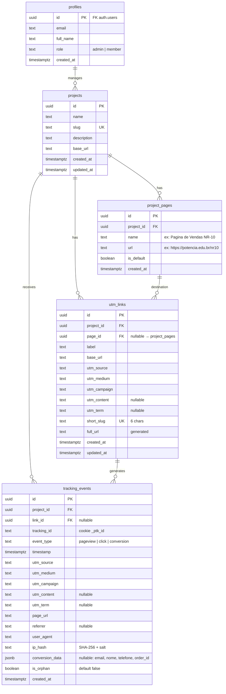
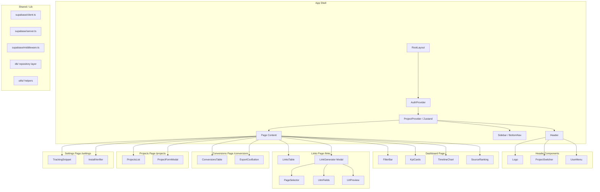
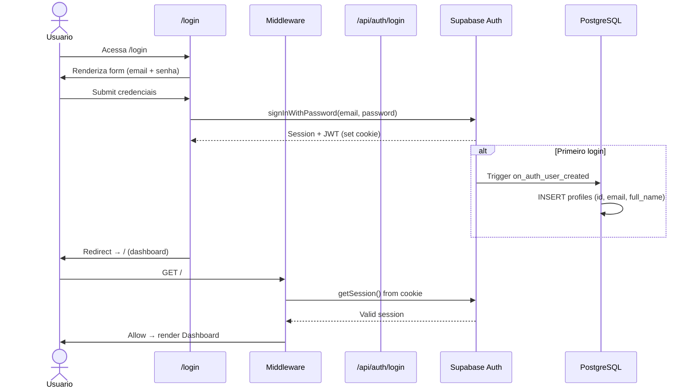
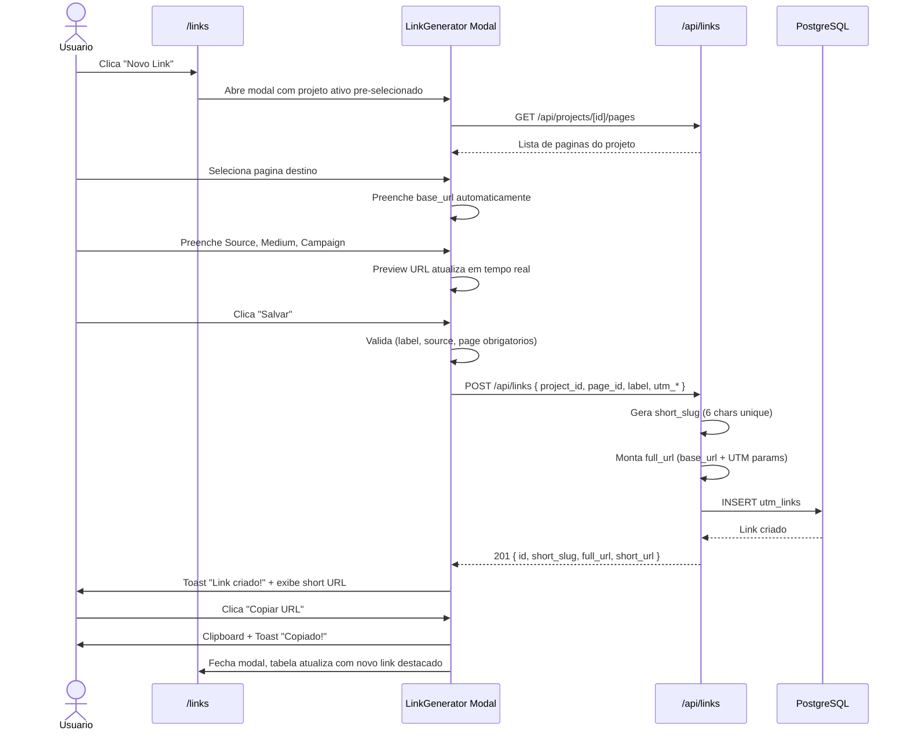
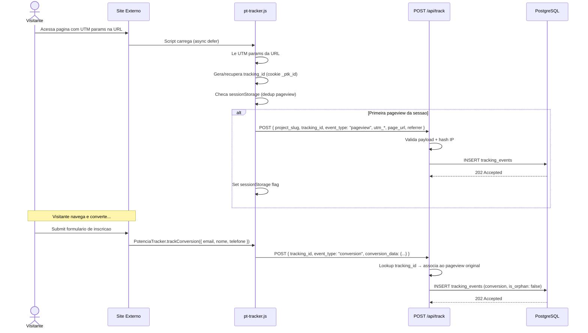
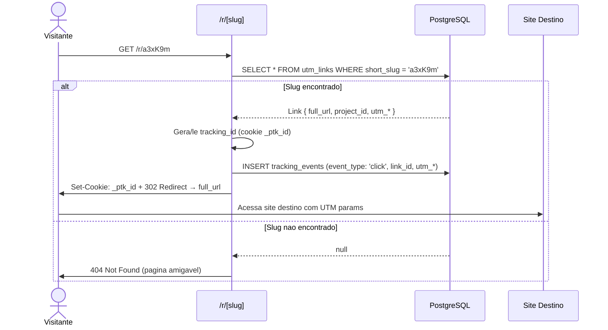
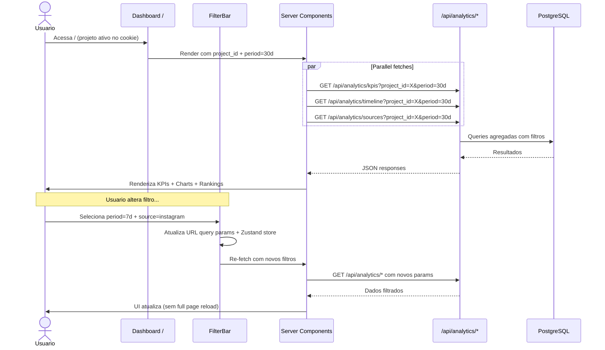

# Potencia Tracking — Fullstack Architecture Document

> Documento de arquitetura completo para o Potencia Tracking — plataforma de tracking UTM multi-projeto.
> Baseado no PRD v0.3 (`docs/prd.md`) e Front-end Spec v0.1 (`docs/front-end-spec.md`).

---

## 1. Introduction

This document outlines the complete fullstack architecture for Potencia Tracking, including backend systems, frontend implementation, and their integration. It serves as the single source of truth for AI-driven development, ensuring consistency across the entire technology stack.

This unified approach combines what would traditionally be separate backend and frontend architecture documents, streamlining the development process for modern fullstack applications where these concerns are increasingly intertwined.

### 1.1 Starter Template or Existing Project

**N/A — Greenfield project.** Sem starter template. Criacao do zero com Next.js 16 App Router.

### 1.2 Change Log

| Date | Version | Description | Author |
|------|---------|-------------|--------|
| 2026-03-10 | 1.0 | Initial architecture document | Aria (Architect) |

---

## 2. High Level Architecture

### 2.1 Technical Summary

Aplicacao **fullstack monolitica** em Next.js 16 (App Router) com React 19 Server Components, deployada na Vercel. Backend via API Routes do Next.js como proxy para Supabase (PostgreSQL + Auth + RLS) self-hosted na VPS WeCoded. Script de tracking standalone em vanilla JS (~15KB), hospedado na Vercel, injetavel em qualquer dominio via `<script>`. Short links via redirect route `/r/[slug]` com registro de clique pre-redirect. Autenticacao SSR com Supabase Auth (cookie-based). Interface dark-mode-first com Tailwind CSS 4 + shadcn/ui + Recharts 3.

### 2.2 Platform and Infrastructure Choice

**Platform:** Vercel (frontend) + VPS WeCoded (Supabase self-hosted)
**Key Services:** Vercel (hosting, edge functions, CDN), Supabase Self-Hosted (PostgreSQL, Auth, RLS) na VPS WeCoded (mesma VPS do Mautic)
**Regions:** Vercel — `gru1` (Sao Paulo), VPS WeCoded — datacenter do provedor

### 2.3 Repository Structure

**Structure:** Monorepo simples (single app, sem workspaces)
**Monorepo Tool:** N/A — projeto unico, sem necessidade de Turborepo/Nx
**Package Organization:** Flat — `src/` com separacao por feature

### 2.4 High Level Architecture Diagram

```mermaid
graph TB
    subgraph "Client Layer"
        A[Browser - Dashboard] -->|HTTPS| B[Vercel Edge Network]
        C[External Sites] -->|script tag| D[pt-tracker.js CDN]
    end

    subgraph "Vercel Platform"
        B --> E[Next.js 16 App Router]
        E --> F[Server Components]
        E --> G[API Routes]
        E --> H[/r/slug Redirect]
    end

    subgraph "API Routes"
        G --> G1[/api/projects]
        G --> G2[/api/links]
        G --> G3[/api/track]
        G --> G4[/api/analytics]
    end

    subgraph "VPS WeCoded — Supabase Self-Hosted"
        G1 & G2 & G3 & G4 --> I[(PostgreSQL)]
        I --> J[projects]
        I --> K[utm_links]
        I --> L[tracking_events]
        I --> M[project_pages]
        I --> N[profiles]
        E --> O[Supabase Auth / GoTrue]
    end

    D -->|POST events| G3
    H -->|log + 302| G3
```

### 2.5 Architectural Patterns

- **Fullstack Monolith (Next.js):** App Router com RSC para data fetching server-side — _Rationale:_ Stack validada no expo-eletrica, sem overhead de microservicos para MVP
- **Server Components First:** RSC para paginas de dados (dashboard, tabelas), Client Components apenas para interatividade — _Rationale:_ Reduz bundle JS, melhora TTI
- **API Routes as BFF:** Proxy entre client e Supabase, nunca expoe keys no browser — _Rationale:_ Seguranca + CORS centralizado
- **Repository Pattern:** Camada `src/lib/db/` abstrai queries Supabase — _Rationale:_ Testabilidade e isolamento do ORM
- **Event-Driven Tracking:** Script envia eventos async para API de ingestao — _Rationale:_ Nao bloqueia UX do site hospedeiro

---

## 3. Tech Stack

| Category | Technology | Version | Purpose | Rationale |
|----------|-----------|---------|---------|-----------|
| Frontend Language | TypeScript | 5.x (strict) | Type safety fullstack | Padrao do ecossistema Next.js |
| Frontend Framework | Next.js | 16+ | App Router, RSC, API Routes | Preset ativo, validado no expo-eletrica |
| React | React | 19 | UI rendering, Server Components | Requerido pelo Next.js 16 |
| UI Components | shadcn/ui | latest | Componentes base (Button, Input, Table, Card, Dialog) | Customizavel, nao e dependencia — copia codigo |
| CSS Framework | Tailwind CSS | 4 | Utility-first styling, dark mode | Ja usado no expo-eletrica |
| State Management | Zustand | 5.x | Client state (projeto ativo, filtros, UI) | Leve, sem boilerplate, preset padrao |
| Charts | Recharts | 3.x | Graficos de tendencia, barras, tooltips | Validado no expo-eletrica-tracking |
| Icons | Lucide React | latest | Iconografia consistente | Ja usado no expo-eletrica |
| Date | date-fns | 4.x | Formatacao, calculos de periodo | Tree-shakeable, ja usado |
| Database | Supabase Self-Hosted (PostgreSQL) | latest | Persistencia, RLS, realtime | Self-hosted na VPS WeCoded |
| Auth | Supabase Auth (GoTrue) | latest | Email/password, sessions SSR | Incluso no Supabase, cookie-based SSR |
| Deploy (Frontend) | Vercel | — | Hosting, CDN, edge, CI/CD | Padrao de todos os projetos HMNews |
| Deploy (Database) | VPS WeCoded | — | Docker Compose Supabase | Mesma VPS do Mautic |
| API Style | REST (Next.js API Routes) | — | BFF proxy para Supabase | Simplicidade, sem GraphQL overhead |
| Frontend Testing | Vitest + Testing Library | latest | Unit + integration de componentes | Rapido, compativel com RSC |
| E2E Testing | Playwright | latest | Fluxos criticos (login → link → dashboard) | Quando necessario, nao obrigatorio no MVP |
| Lint | ESLint + Prettier | latest | Code quality + formatting | Padrao Next.js |
| Build Tool | Next.js (Turbopack) | — | Dev server + build | Built-in no Next.js 16 |
| Monitoring | Vercel Analytics + Sentry | — | Performance + error tracking | Free tier suficiente pro MVP |
| Logging | console + Vercel Logs | — | Server-side logging | Sem overhead extra pro MVP |
| Cache | N/A (ISR + Supabase) | — | ISR para paginas estaticas, Supabase cache | Sem Redis — complexidade desnecessaria |
| File Storage | N/A | — | MVP nao precisa de uploads | Supabase Storage disponivel se necessario |

---

## 4. Data Models

### 4.1 Entity Relationship Diagram



### 4.2 TypeScript Interfaces

```typescript
// src/types/database.ts

interface Profile {
  id: string;              // UUID, FK auth.users
  email: string;
  full_name: string;
  role: 'admin' | 'member';
  created_at: string;
}

interface Project {
  id: string;
  name: string;
  slug: string;            // unique, auto-generated
  description: string | null;
  base_url: string;
  created_at: string;
  updated_at: string;
}

interface ProjectPage {
  id: string;
  project_id: string;
  name: string;
  url: string;
  is_default: boolean;
  created_at: string;
}

interface UtmLink {
  id: string;
  project_id: string;
  page_id: string | null;
  label: string;
  base_url: string;
  utm_source: string;
  utm_medium: string;
  utm_campaign: string;
  utm_content: string | null;
  utm_term: string | null;
  short_slug: string;       // 6 chars, unique
  full_url: string;          // generated
  created_at: string;
  updated_at: string;
}

interface TrackingEvent {
  id: string;
  project_id: string;
  link_id: string | null;
  tracking_id: string;       // cookie _ptk_id
  event_type: 'pageview' | 'click' | 'conversion';
  timestamp: string;
  utm_source: string;
  utm_medium: string;
  utm_campaign: string;
  utm_content: string | null;
  utm_term: string | null;
  page_url: string;
  referrer: string | null;
  user_agent: string;
  ip_hash: string;
  conversion_data: ConversionData | null;
  is_orphan: boolean;
  created_at: string;
}

interface ConversionData {
  email?: string;
  nome?: string;
  telefone?: string;
  order_id?: string;
  [key: string]: unknown;   // extensivel
}
```

### 4.3 Relationships

- **profiles → projects:** 1:N — um usuario gerencia multiplos projetos
- **projects → project_pages:** 1:N — cada projeto tem multiplas paginas de destino
- **projects → utm_links:** 1:N — cada projeto tem multiplos links UTM
- **project_pages → utm_links:** 1:N (opcional) — link pode referenciar uma pagina de destino
- **projects → tracking_events:** 1:N — cada projeto recebe multiplos eventos
- **utm_links → tracking_events:** 1:N (opcional) — evento pode ou nao estar vinculado a um link (link_id nullable para eventos diretos do script)

### 4.4 Design Decisions

| Decision | Choice | Rationale |
|----------|--------|-----------|
| `conversion_data` como JSONB | Flexivel, sem tabela extra | Campos opcionais e extensiveis — cada site pode enviar dados diferentes |
| `ip_hash` ao inves de IP raw | SHA-256 + salt rotativo | Compliance LGPD — nao armazena dados identificaveis |
| `short_slug` 6 chars | 2.1B combinacoes (62^6) | Suficiente para milhoes de links, colisao < 0.001% |
| `tracking_id` em texto (nao FK) | UUID gerado no client | Tracking_id vem do cookie do visitante, nao existe como entidade no banco |
| `event_type` como text enum | `pageview \| click \| conversion` | Simples, extensivel sem migration |
| `page_id` nullable em utm_links | Backward compatible | Links antigos migrados podem nao ter pagina associada |

---

## 5. API Specification

### 5.1 Overview

```yaml
openapi: 3.0.0
info:
  title: Potencia Tracking API
  version: 1.0.0
  description: API interna (BFF) para o Potencia Tracking. Todas as rotas (exceto /api/track e /r/[slug]) requerem autenticacao.
servers:
  - url: https://potencia-tracking.vercel.app
    description: Production
  - url: http://localhost:3000
    description: Development
```

### 5.2 Auth Endpoints

| Method | Path | Auth | Description |
|--------|------|------|-------------|
| `POST` | `/api/auth/login` | No | Login email/password via Supabase Auth |
| `POST` | `/api/auth/logout` | Yes | Encerra sessao, limpa cookie |
| `GET` | `/api/auth/me` | Yes | Retorna perfil do usuario logado |
| `POST` | `/api/auth/callback` | No | Callback OAuth/magic link (Supabase SSR) |

### 5.3 Projects Endpoints

| Method | Path | Auth | Description |
|--------|------|------|-------------|
| `GET` | `/api/projects` | Yes | Lista todos os projetos do usuario |
| `POST` | `/api/projects` | Yes | Cria novo projeto |
| `GET` | `/api/projects/[id]` | Yes | Detalhe de um projeto |
| `PATCH` | `/api/projects/[id]` | Yes | Atualiza projeto |
| `DELETE` | `/api/projects/[id]` | Yes | Remove projeto (soft delete) |

```typescript
// POST /api/projects - Request
{ name: string; slug?: string; description?: string; base_url: string }

// Response 201
{ id: string; name: string; slug: string; base_url: string; created_at: string }
```

### 5.4 Project Pages Endpoints

| Method | Path | Auth | Description |
|--------|------|------|-------------|
| `GET` | `/api/projects/[id]/pages` | Yes | Lista paginas do projeto |
| `POST` | `/api/projects/[id]/pages` | Yes | Cria nova pagina |
| `PATCH` | `/api/pages/[id]` | Yes | Atualiza pagina |
| `DELETE` | `/api/pages/[id]` | Yes | Remove pagina |

### 5.5 Links Endpoints

| Method | Path | Auth | Description |
|--------|------|------|-------------|
| `GET` | `/api/links?project_id=X&search=Y&page=1` | Yes | Lista links com busca e paginacao |
| `POST` | `/api/links` | Yes | Cria link UTM + gera short_slug |
| `GET` | `/api/links/[id]` | Yes | Detalhe de um link |
| `PATCH` | `/api/links/[id]` | Yes | Atualiza link |
| `DELETE` | `/api/links/[id]` | Yes | Remove link |
| `POST` | `/api/links/[id]/duplicate` | Yes | Duplica link com sufixo "-copy" |

```typescript
// POST /api/links - Request
{
  project_id: string;
  page_id?: string;
  label: string;
  base_url: string;
  utm_source: string;
  utm_medium: string;
  utm_campaign: string;
  utm_content?: string;
  utm_term?: string;
}

// Response 201
{
  id: string;
  short_slug: string;      // "a3xK9m"
  full_url: string;         // "https://potencia.edu.br/nr10?utm_source=..."
  short_url: string;        // "https://potencia-tracking.vercel.app/r/a3xK9m"
  ...UtmLink
}
```

### 5.6 Tracking Endpoints (Public)

| Method | Path | Auth | CORS | Description |
|--------|------|------|------|-------------|
| `POST` | `/api/track` | **No** | `*` (any origin) | Recebe eventos do script |
| `GET` | `/api/track/health` | **No** | `*` | Health check |
| `GET` | `/r/[slug]` | **No** | — | Redirect 302 + log click |

```typescript
// POST /api/track - Request
{
  project_slug: string;
  tracking_id: string;
  event_type: 'pageview' | 'click' | 'conversion';
  timestamp: string;        // ISO 8601
  utm_source?: string;
  utm_medium?: string;
  utm_campaign?: string;
  utm_content?: string;
  utm_term?: string;
  page_url: string;
  referrer?: string;
  user_agent: string;
  conversion_data?: {
    email?: string;
    nome?: string;
    telefone?: string;
    order_id?: string;
  }
}

// Response 202
{ ok: true; event_id: string }
```

**Rate Limiting:** 100 req/min por IP no `/api/track`. Header `X-RateLimit-Remaining`.

### 5.7 Analytics Endpoints

| Method | Path | Auth | Description |
|--------|------|------|-------------|
| `GET` | `/api/analytics/kpis?project_id=X&period=30d` | Yes | KPI cards (cliques, conversoes, taxa, top source) |
| `GET` | `/api/analytics/timeline?project_id=X&period=30d&metric=clicks` | Yes | Dados para grafico de tendencia |
| `GET` | `/api/analytics/sources?project_id=X&period=30d` | Yes | Ranking top 10 sources |
| `GET` | `/api/analytics/conversions?project_id=X&period=30d&search=Y&page=1&sort=timestamp&order=desc` | Yes | Tabela de conversoes paginada |
| `GET` | `/api/analytics/conversions/export?project_id=X&period=30d` | Yes | Export CSV (UTF-8 BOM) |

```typescript
// GET /api/analytics/kpis - Response
{
  total_clicks: number;
  total_conversions: number;
  conversion_rate: number;       // percentage
  top_source: string;
  period_comparison: {
    clicks_change: number;       // +12.5 ou -3.2
    conversions_change: number;
  }
}

// GET /api/analytics/timeline - Response
{
  granularity: 'hour' | 'day' | 'week';
  data: Array<{
    date: string;
    clicks: number;
    conversions: number;
  }>
}
```

### 5.8 Redirect Flow `/r/[slug]`

```
1. GET /r/a3xK9m
2. Lookup utm_links WHERE short_slug = 'a3xK9m'
3. If not found → 404 page
4. Extract/set tracking_id from cookie _ptk_id (or generate new)
5. INSERT tracking_events (event_type: 'click', link_id, utm_params from link)
6. Set-Cookie: _ptk_id={tracking_id}; Max-Age=15552000; Path=/; SameSite=Lax
7. 302 Redirect → full_url
   Target: < 200ms total
```

---

## 6. Components

### 6.1 Component Map



### 6.2 Component Breakdown

#### App Shell

| Component | Responsibility | Tech Details |
|-----------|---------------|--------------|
| **RootLayout** | HTML root, fonts (Inter), ThemeProvider, metadata | Server Component, `src/app/layout.tsx` |
| **AuthProvider** | Sessao Supabase SSR, refresh token, redirect se expirado | Client Component, wraps Supabase `onAuthStateChange` |
| **ProjectProvider** | Estado global do projeto ativo, filtros, periodo | Zustand store, persiste `activeProjectId` em cookie |
| **Header** | Logo + ProjectSwitcher + UserMenu, colapsa em hamburger no mobile | Client Component, sticky top |
| **Sidebar** | Nav items: Dashboard, Links, Conversoes, Projetos, Settings | Server Component com active state via pathname |
| **BottomNav** | Mesmo que Sidebar mas fixo no bottom para mobile (<768px) | Client Component, hidden on desktop |

#### Dashboard Components

| Component | Responsibility | Dependencies |
|-----------|---------------|-------------|
| **FilterBar** | Period selector (presets + custom), Source/Medium/Campaign dropdowns, sync com URL query params | Zustand (filtros), `useSearchParams`, shadcn Select + DatePicker |
| **KpiCards** | 4 cards: Cliques, Conversoes, Taxa, Top Source — com variacao % | Server Component, `GET /api/analytics/kpis` |
| **TimelineChart** | Grafico de linha (cliques + conversoes ao longo do tempo), granularidade auto | Client Component, Recharts `LineChart`, responsivo |
| **SourceRanking** | Barras horizontais top 10 sources, cores fixas por canal | Client Component, Recharts `BarChart` |

#### Links Components

| Component | Responsibility | Dependencies |
|-----------|---------------|-------------|
| **LinksTable** | Tabela com busca, sort, paginacao (20/page), acoes por row | Server Component + Client interativity, shadcn Table |
| **LinkGenerator** | Modal/sheet com formulario completo de criacao UTM | Client Component, shadcn Dialog + Form |
| **PageSelector** | Combobox com paginas do projeto + "Adicionar nova" inline | Client Component, shadcn Combobox |
| **UtmFields** | Source/Medium com presets dropdown + custom input, Campaign/Content/Term | Client Component, shadcn Select + Input |
| **UrlPreview** | Preview em tempo real da URL montada + botao Copiar | Client Component, `navigator.clipboard` |

#### Conversions & Settings

| Component | Responsibility | Dependencies |
|-----------|---------------|-------------|
| **ConversionsTable** | Tabela com busca, sort, paginacao (25/page), rows expandiveis | Server + Client, shadcn Table + Collapsible |
| **ExportCsvButton** | Gera CSV com UTF-8 BOM de todos os dados filtrados (nao so a pagina) | Client Component, streaming download |
| **TrackingSnippet** | Bloco de codigo copiavel com `<script>` pre-preenchido | Server Component, shadcn CodeBlock |
| **InstallVerifier** | Botao "Verificar Instalacao" — ping ao dominio do projeto | Client Component, fetch + status badge |

### 6.3 Shared Services Layer (`src/lib/`)

| Module | Responsibility |
|--------|---------------|
| `supabase/client.ts` | Supabase client browser-side (anon key) |
| `supabase/server.ts` | Supabase client server-side (service role, cookies) |
| `supabase/middleware.ts` | Refresh session em cada request, protege rotas |
| `db/projects.ts` | Repository: CRUD projects, getBySlug |
| `db/links.ts` | Repository: CRUD links, generateSlug, buildFullUrl |
| `db/tracking.ts` | Repository: insertEvent, getKpis, getTimeline, getSources |
| `db/pages.ts` | Repository: CRUD project_pages |
| `utils/utm.ts` | Sanitize UTM params (kebab-case), validate, build URL |
| `utils/csv.ts` | Generate CSV com BOM, streaming |
| `utils/hash.ts` | IP hashing (SHA-256 + salt) |
| `stores/project-store.ts` | Zustand: activeProjectId, filters, period |

---

## 7. Core Workflows

### 7.1 Login Flow



### 7.2 Criar Link UTM



### 7.3 Tracking Flow (Script → API → DB)



### 7.4 Short Link Redirect



### 7.5 Dashboard Data Flow



---

## 8. Database Schema

### 8.1 SQL DDL (Supabase/PostgreSQL)

```sql
-- ============================================
-- Potencia Tracking — Database Schema v1.0
-- Supabase Self-Hosted (VPS WeCoded)
-- ============================================

-- 1. PROFILES (extends auth.users)
CREATE TABLE public.profiles (
  id          UUID PRIMARY KEY REFERENCES auth.users(id) ON DELETE CASCADE,
  email       TEXT NOT NULL,
  full_name   TEXT NOT NULL DEFAULT '',
  role        TEXT NOT NULL DEFAULT 'member' CHECK (role IN ('admin', 'member')),
  created_at  TIMESTAMPTZ NOT NULL DEFAULT now()
);

-- Auto-create profile on signup
CREATE OR REPLACE FUNCTION public.handle_new_user()
RETURNS TRIGGER AS $$
BEGIN
  INSERT INTO public.profiles (id, email, full_name)
  VALUES (
    NEW.id,
    NEW.email,
    COALESCE(NEW.raw_user_meta_data->>'full_name', '')
  );
  RETURN NEW;
END;
$$ LANGUAGE plpgsql SECURITY DEFINER;

CREATE TRIGGER on_auth_user_created
  AFTER INSERT ON auth.users
  FOR EACH ROW EXECUTE FUNCTION public.handle_new_user();

-- 2. PROJECTS
CREATE TABLE public.projects (
  id          UUID PRIMARY KEY DEFAULT gen_random_uuid(),
  name        TEXT NOT NULL,
  slug        TEXT NOT NULL UNIQUE,
  description TEXT,
  base_url    TEXT NOT NULL,
  created_at  TIMESTAMPTZ NOT NULL DEFAULT now(),
  updated_at  TIMESTAMPTZ NOT NULL DEFAULT now()
);

CREATE INDEX idx_projects_slug ON public.projects(slug);

-- 3. PROJECT PAGES
CREATE TABLE public.project_pages (
  id          UUID PRIMARY KEY DEFAULT gen_random_uuid(),
  project_id  UUID NOT NULL REFERENCES public.projects(id) ON DELETE CASCADE,
  name        TEXT NOT NULL,
  url         TEXT NOT NULL,
  is_default  BOOLEAN NOT NULL DEFAULT false,
  created_at  TIMESTAMPTZ NOT NULL DEFAULT now()
);

CREATE INDEX idx_project_pages_project ON public.project_pages(project_id);

-- Ensure only one default page per project
CREATE UNIQUE INDEX idx_project_pages_default
  ON public.project_pages(project_id)
  WHERE is_default = true;

-- 4. UTM LINKS
CREATE TABLE public.utm_links (
  id           UUID PRIMARY KEY DEFAULT gen_random_uuid(),
  project_id   UUID NOT NULL REFERENCES public.projects(id) ON DELETE CASCADE,
  page_id      UUID REFERENCES public.project_pages(id) ON DELETE SET NULL,
  label        TEXT NOT NULL,
  base_url     TEXT NOT NULL,
  utm_source   TEXT NOT NULL,
  utm_medium   TEXT NOT NULL DEFAULT '',
  utm_campaign TEXT NOT NULL DEFAULT '',
  utm_content  TEXT,
  utm_term     TEXT,
  short_slug   TEXT NOT NULL UNIQUE,
  full_url     TEXT NOT NULL,
  created_at   TIMESTAMPTZ NOT NULL DEFAULT now(),
  updated_at   TIMESTAMPTZ NOT NULL DEFAULT now()
);

CREATE INDEX idx_utm_links_project ON public.utm_links(project_id);
CREATE INDEX idx_utm_links_slug ON public.utm_links(short_slug);
CREATE INDEX idx_utm_links_search ON public.utm_links(project_id, label, utm_source, utm_campaign);

-- 5. TRACKING EVENTS
CREATE TABLE public.tracking_events (
  id              UUID PRIMARY KEY DEFAULT gen_random_uuid(),
  project_id      UUID NOT NULL REFERENCES public.projects(id) ON DELETE CASCADE,
  link_id         UUID REFERENCES public.utm_links(id) ON DELETE SET NULL,
  tracking_id     TEXT NOT NULL,
  event_type      TEXT NOT NULL CHECK (event_type IN ('pageview', 'click', 'conversion')),
  timestamp       TIMESTAMPTZ NOT NULL DEFAULT now(),
  utm_source      TEXT NOT NULL DEFAULT '',
  utm_medium      TEXT NOT NULL DEFAULT '',
  utm_campaign    TEXT NOT NULL DEFAULT '',
  utm_content     TEXT,
  utm_term        TEXT,
  page_url        TEXT NOT NULL DEFAULT '',
  referrer        TEXT,
  user_agent      TEXT NOT NULL DEFAULT '',
  ip_hash         TEXT NOT NULL DEFAULT '',
  conversion_data JSONB,
  is_orphan       BOOLEAN NOT NULL DEFAULT false,
  created_at      TIMESTAMPTZ NOT NULL DEFAULT now()
);

-- Performance indexes for analytics queries
CREATE INDEX idx_tracking_project_time
  ON public.tracking_events(project_id, timestamp DESC);

CREATE INDEX idx_tracking_project_type_time
  ON public.tracking_events(project_id, event_type, timestamp DESC);

CREATE INDEX idx_tracking_source
  ON public.tracking_events(project_id, utm_source, timestamp DESC);

CREATE INDEX idx_tracking_campaign
  ON public.tracking_events(project_id, utm_campaign, timestamp DESC)
  WHERE utm_campaign != '';

CREATE INDEX idx_tracking_tracking_id
  ON public.tracking_events(tracking_id);

CREATE INDEX idx_tracking_link
  ON public.tracking_events(link_id)
  WHERE link_id IS NOT NULL;

-- Partial index for conversions (queries frequentes)
CREATE INDEX idx_tracking_conversions
  ON public.tracking_events(project_id, timestamp DESC)
  WHERE event_type = 'conversion';
```

### 8.2 RLS Policies

```sql
-- ============================================
-- Row Level Security — Authenticated users only
-- ============================================

ALTER TABLE public.profiles ENABLE ROW LEVEL SECURITY;
ALTER TABLE public.projects ENABLE ROW LEVEL SECURITY;
ALTER TABLE public.project_pages ENABLE ROW LEVEL SECURITY;
ALTER TABLE public.utm_links ENABLE ROW LEVEL SECURITY;
ALTER TABLE public.tracking_events ENABLE ROW LEVEL SECURITY;

-- PROFILES: users can read/update own profile
CREATE POLICY "profiles_select_own" ON public.profiles
  FOR SELECT USING (auth.uid() = id);

CREATE POLICY "profiles_update_own" ON public.profiles
  FOR UPDATE USING (auth.uid() = id);

-- PROJECTS: all authenticated users can CRUD
-- (MVP: equipe interna, sem multi-tenant)
CREATE POLICY "projects_select" ON public.projects
  FOR SELECT TO authenticated USING (true);

CREATE POLICY "projects_insert" ON public.projects
  FOR INSERT TO authenticated WITH CHECK (true);

CREATE POLICY "projects_update" ON public.projects
  FOR UPDATE TO authenticated USING (true);

CREATE POLICY "projects_delete" ON public.projects
  FOR DELETE TO authenticated USING (true);

-- PROJECT PAGES: same as projects
CREATE POLICY "pages_select" ON public.project_pages
  FOR SELECT TO authenticated USING (true);

CREATE POLICY "pages_insert" ON public.project_pages
  FOR INSERT TO authenticated WITH CHECK (true);

CREATE POLICY "pages_update" ON public.project_pages
  FOR UPDATE TO authenticated USING (true);

CREATE POLICY "pages_delete" ON public.project_pages
  FOR DELETE TO authenticated USING (true);

-- UTM LINKS: same as projects
CREATE POLICY "links_select" ON public.utm_links
  FOR SELECT TO authenticated USING (true);

CREATE POLICY "links_insert" ON public.utm_links
  FOR INSERT TO authenticated WITH CHECK (true);

CREATE POLICY "links_update" ON public.utm_links
  FOR UPDATE TO authenticated USING (true);

CREATE POLICY "links_delete" ON public.utm_links
  FOR DELETE TO authenticated USING (true);

-- TRACKING EVENTS: authenticated can read, service_role inserts
-- (script usa service_role key via API route)
CREATE POLICY "events_select" ON public.tracking_events
  FOR SELECT TO authenticated USING (true);

CREATE POLICY "events_insert_service" ON public.tracking_events
  FOR INSERT TO service_role WITH CHECK (true);
```

### 8.3 Seed Data

```sql
-- Projeto padrao
INSERT INTO public.projects (name, slug, description, base_url)
VALUES (
  'Potencia Educacao — Geral',
  'potencia-geral',
  'Projeto padrao para tracking geral da Potencia Educacao',
  'https://potencia.edu.br'
);

-- Pagina padrao do projeto
INSERT INTO public.project_pages (project_id, name, url, is_default)
SELECT id, 'Site Principal', 'https://potencia.edu.br', true
FROM public.projects WHERE slug = 'potencia-geral';
```

### 8.4 Updated_at Trigger

```sql
-- Auto-update updated_at on row change
CREATE OR REPLACE FUNCTION public.handle_updated_at()
RETURNS TRIGGER AS $$
BEGIN
  NEW.updated_at = now();
  RETURN NEW;
END;
$$ LANGUAGE plpgsql;

CREATE TRIGGER set_updated_at
  BEFORE UPDATE ON public.projects
  FOR EACH ROW EXECUTE FUNCTION public.handle_updated_at();

CREATE TRIGGER set_updated_at
  BEFORE UPDATE ON public.utm_links
  FOR EACH ROW EXECUTE FUNCTION public.handle_updated_at();
```

### 8.5 Index Strategy Summary

| Index | Table | Columns | Purpose |
|-------|-------|---------|---------|
| `idx_projects_slug` | projects | slug | Lookup por slug (redirect, API) |
| `idx_project_pages_project` | project_pages | project_id | Listar paginas por projeto |
| `idx_project_pages_default` | project_pages | project_id WHERE is_default | Garantir 1 default por projeto |
| `idx_utm_links_project` | utm_links | project_id | Listar links por projeto |
| `idx_utm_links_slug` | utm_links | short_slug | Redirect /r/[slug] — critico, < 5ms |
| `idx_utm_links_search` | utm_links | project_id, label, source, campaign | Busca na tabela de links |
| `idx_tracking_project_time` | tracking_events | project_id, timestamp DESC | Dashboard KPIs e timeline |
| `idx_tracking_project_type_time` | tracking_events | project_id, event_type, timestamp DESC | Filtro por tipo de evento |
| `idx_tracking_source` | tracking_events | project_id, utm_source, timestamp DESC | Ranking de sources |
| `idx_tracking_campaign` | tracking_events | project_id, utm_campaign (partial) | Filtro por campanha |
| `idx_tracking_tracking_id` | tracking_events | tracking_id | Associar conversao ↔ pageview |
| `idx_tracking_conversions` | tracking_events | project_id, timestamp (partial) | Tabela de conversoes |
| `idx_tracking_link` | tracking_events | link_id (partial) | Stats por link especifico |

### 8.6 Data Retention (NFR8)

```sql
-- Job agendado (pg_cron ou external cron):
-- Executar mensalmente, arquiva eventos > 365 dias
-- Para MVP: manual via SQL. Pos-MVP: pg_cron

-- Archive old events (example)
-- DELETE FROM public.tracking_events
-- WHERE timestamp < now() - INTERVAL '365 days';
```

---

## 9. Frontend Architecture

### 9.1 Component Organization

```
src/
├── app/                          # Next.js App Router
│   ├── layout.tsx                # RootLayout: fonts, ThemeProvider, AuthProvider
│   ├── page.tsx                  # Dashboard (Server Component)
│   ├── login/
│   │   └── page.tsx              # Login form
│   ├── links/
│   │   └── page.tsx              # Links Manager + Generator
│   ├── conversions/
│   │   └── page.tsx              # Conversions table + export
│   ├── projects/
│   │   └── page.tsx              # Projects CRUD
│   ├── settings/
│   │   ├── page.tsx              # Settings overview
│   │   └── tracking/
│   │       └── page.tsx          # Tracking snippet + verifier
│   ├── r/
│   │   └── [slug]/
│   │       └── route.ts          # Short link redirect (Route Handler)
│   └── api/                      # API Routes (see Section 5)
│
├── components/
│   ├── ui/                       # shadcn/ui components (auto-generated)
│   ├── layout/                   # Header, Sidebar, BottomNav, ProjectSwitcher, UserMenu
│   ├── dashboard/                # FilterBar, KpiCards, TimelineChart, SourceRanking
│   ├── links/                    # LinksTable, LinkGenerator, PageSelector, UtmFields, UrlPreview
│   ├── conversions/              # ConversionsTable, ExportCsvButton
│   ├── projects/                 # ProjectsList, ProjectForm
│   └── settings/                 # TrackingSnippet, InstallVerifier
│
├── lib/
│   ├── supabase/                 # client.ts, server.ts, middleware.ts
│   ├── db/                       # Repository layer: projects, pages, links, tracking, profiles
│   ├── auth/                     # guard.ts (withAuth helper)
│   └── utils/                    # utm, csv, hash, slug, rate-limit, date
│
├── stores/
│   └── project-store.ts          # Zustand: activeProjectId, filters
│
├── types/
│   ├── database.ts               # Interfaces: Project, UtmLink, TrackingEvent, etc.
│   └── api.ts                    # Request/Response types
│
├── hooks/
│   ├── use-project.ts            # Hook para acessar projeto ativo
│   ├── use-filters.ts            # Hook para filtros do dashboard
│   └── use-copy.ts               # Hook clipboard + toast
│
├── styles/
│   └── globals.css               # Tailwind directives + CSS variables (theme)
│
└── middleware.ts                  # Auth guard: redirect /login se nao autenticado
```

### 9.2 Component Patterns

**Server Component (default):** Data fetching direto, sem client JS.

```typescript
// src/app/page.tsx
export default async function DashboardPage({ searchParams }) {
  const params = await searchParams;
  const supabase = await createServerClient();
  const kpis = await getKpis(supabase, { projectId, period: params.period ?? '30d' });
  return <KpiCards data={kpis} />;
}
```

**Client Component:** Apenas quando precisa de hooks, events, browser APIs.

```typescript
// src/components/dashboard/filter-bar.tsx
'use client';
export function FilterBar() {
  const searchParams = useSearchParams();
  // ... interactivity
}
```

### 9.3 State Management (Zustand)

```typescript
// src/stores/project-store.ts
import { create } from 'zustand';
import { persist } from 'zustand/middleware';

interface ProjectState {
  activeProjectId: string | null;
  activeProjectSlug: string | null;
  setActiveProject: (id: string, slug: string) => void;
}

export const useProjectStore = create<ProjectState>()(
  persist(
    (set) => ({
      activeProjectId: null,
      activeProjectSlug: null,
      setActiveProject: (id, slug) =>
        set({ activeProjectId: id, activeProjectSlug: slug }),
    }),
    { name: 'ptk-project' }
  )
);
```

**State Patterns:**
- **Server state (DB data):** Server Components fetch direto
- **URL state (filtros):** `searchParams` como source of truth
- **Client state (projeto ativo, UI):** Zustand com `persist`
- **Form state:** React `useState` local
- **Auth state:** Supabase `onAuthStateChange` no AuthProvider

### 9.4 Routing

| Route | Type | Auth | Component |
|-------|------|------|-----------|
| `/login` | Page | No | Login form |
| `/` | Page | Yes | Dashboard (KPIs + Charts) |
| `/links` | Page | Yes | Links table + generator |
| `/conversions` | Page | Yes | Conversions table + export |
| `/projects` | Page | Yes | Projects CRUD |
| `/settings` | Page | Yes | Settings overview |
| `/settings/tracking` | Page | Yes | Script snippet + verifier |
| `/r/[slug]` | Route Handler | No | 302 redirect + log |
| `/api/*` | Route Handlers | Mixed | REST API |

### 9.5 Auth Middleware

```typescript
// src/middleware.ts
import { NextResponse, type NextRequest } from 'next/server';
import { createServerClient } from '@supabase/ssr';

const PUBLIC_ROUTES = ['/login', '/api/track', '/api/track/health', '/r/'];

export async function middleware(request: NextRequest) {
  const { pathname } = request.nextUrl;
  if (PUBLIC_ROUTES.some((route) => pathname.startsWith(route))) {
    return NextResponse.next();
  }

  const response = NextResponse.next();
  const supabase = createServerClient(
    process.env.NEXT_PUBLIC_SUPABASE_URL!,
    process.env.NEXT_PUBLIC_SUPABASE_ANON_KEY!,
    {
      cookies: {
        getAll: () => request.cookies.getAll(),
        setAll: (cookies) => {
          cookies.forEach(({ name, value, options }) => {
            response.cookies.set(name, value, options);
          });
        },
      },
    }
  );

  const { data: { session } } = await supabase.auth.getSession();
  if (!session) {
    return NextResponse.redirect(new URL('/login', request.url));
  }
  return response;
}

export const config = {
  matcher: ['/((?!_next/static|_next/image|favicon.ico|public/).*)'],
};
```

---

## 10. Backend Architecture

### 10.1 Service Architecture (Serverless — Next.js API Routes)

All backend logic lives in `src/app/api/` as Next.js Route Handlers. No separate server.

### 10.2 Route Handler Pattern

```typescript
// Standard authenticated route
import { NextRequest, NextResponse } from 'next/server';
import { createServerClient } from '@/lib/supabase/server';

export async function GET() {
  const supabase = await createServerClient();
  const { data: { user } } = await supabase.auth.getUser();
  if (!user) return NextResponse.json({ error: 'Unauthorized' }, { status: 401 });

  const data = await listItems(supabase);
  return NextResponse.json(data);
}
```

### 10.3 Tracking Ingestion (Public — Service Role)

Uses `SUPABASE_SERVICE_ROLE_KEY` to bypass RLS. Rate limited at 100 req/min per IP. Returns 202 Accepted immediately. CORS: `Access-Control-Allow-Origin: *`.

### 10.4 Short Link Redirect

`/r/[slug]` → lookup link → generate/read tracking_id cookie → fire-and-forget INSERT tracking_event → 302 redirect. Target: < 200ms.

### 10.5 Rate Limiting (In-Memory for MVP)

In-memory Map with 60s window, 100 req/min. Stale entry cleanup every 5 minutes. For scale: migrate to Vercel KV or Upstash Redis.

### 10.6 IP Hashing (LGPD)

SHA-256 + configurable salt, truncated to 16 chars. Irreversible. Stored in `ip_hash` column.

---

## 11. Unified Project Structure

```
potencia-tracking/
├── .github/
│   └── workflows/
│       └── ci.yaml
├── public/
│   ├── tracking/
│   │   └── pt-tracker.js
│   ├── favicon.ico
│   └── logo.svg
├── src/
│   ├── app/
│   │   ├── layout.tsx
│   │   ├── page.tsx
│   │   ├── not-found.tsx
│   │   ├── error.tsx
│   │   ├── login/page.tsx
│   │   ├── links/page.tsx
│   │   ├── conversions/page.tsx
│   │   ├── projects/page.tsx
│   │   ├── settings/page.tsx
│   │   ├── settings/tracking/page.tsx
│   │   ├── r/[slug]/route.ts
│   │   └── api/...
│   ├── components/
│   │   ├── ui/
│   │   ├── layout/
│   │   ├── dashboard/
│   │   ├── links/
│   │   ├── conversions/
│   │   ├── projects/
│   │   └── settings/
│   ├── lib/
│   │   ├── supabase/
│   │   ├── db/
│   │   ├── auth/
│   │   └── utils/
│   ├── stores/
│   ├── types/
│   ├── hooks/
│   ├── styles/
│   └── middleware.ts
├── supabase/
│   ├── migrations/
│   │   └── 001_initial_schema.sql
│   ├── seed.sql
│   └── config.toml
├── docs/
│   ├── prd.md
│   ├── front-end-spec.md
│   ├── architecture.md
│   └── stories/
├── tests/
│   └── e2e/
├── .env.example
├── .eslintrc.json
├── .prettierrc
├── .gitignore
├── components.json
├── next.config.ts
├── tsconfig.json
├── vitest.config.ts
├── playwright.config.ts
├── package.json
└── README.md
```

**~90 files** (excluding shadcn/ui auto-generated and node_modules).

---

## 12. Development Workflow

### 12.1 Prerequisites

```bash
node --version    # >= 18.18 (LTS)
npm --version     # >= 9
git --version     # >= 2.40
gh --version      # GitHub CLI
```

### 12.2 Initial Setup

```bash
git clone https://github.com/hmnews-potencia/potencia-tracking.git
cd potencia-tracking
npm install
cp .env.example .env.local
# Fill: NEXT_PUBLIC_SUPABASE_URL, NEXT_PUBLIC_SUPABASE_ANON_KEY, SUPABASE_SERVICE_ROLE_KEY, IP_HASH_SALT
npx shadcn@latest init
npm run dev
```

### 12.3 Development Commands

```bash
npm run dev               # Next.js dev (Turbopack) → localhost:3000
npm run build             # Production build
npm run lint              # ESLint
npm run typecheck         # tsc --noEmit
npm run test              # Vitest
npm run test:e2e          # Playwright
npm run generate:types    # Supabase type gen
```

### 12.4 Git Workflow

**Branch naming:** `{type}/{story-id}-{description}`
**Commit convention:** Conventional Commits (`feat:`, `fix:`, `chore:`, `docs:`)

```
main ──────────────────────────────────────────►
  └── feat/1.1-project-bootstrap ──────┘ (squash merge)
  └── feat/1.2-database-schema ────────┘
  └── feat/1.3-auth ───────────────────┘
```

### 12.5 CI Pipeline

```yaml
name: CI
on:
  pull_request:
    branches: [main]
jobs:
  quality:
    runs-on: ubuntu-latest
    steps:
      - uses: actions/checkout@v4
      - uses: actions/setup-node@v4
        with: { node-version: 20, cache: npm }
      - run: npm ci
      - run: npm run lint
      - run: npm run typecheck
      - run: npm run test
```

Deploy via Vercel Git Integration (auto on push to main).

---

## 13. Deployment Architecture

### 13.1 Infrastructure Map

```
┌─────────────────────────────────────┐
│          Vercel (Frontend)          │
│  potencia-tracking.vercel.app       │
│  Next.js 16 App Router + API Routes│
│  pt-tracker.js (CDN)               │
└──────────────────┬──────────────────┘
                   │ HTTPS
                   ▼
┌─────────────────────────────────────┐
│     VPS WeCoded (Backend Data)      │
│                                     │
│  Supabase Self-Hosted (Docker)      │
│  • PostgreSQL 15+                   │
│  • GoTrue (Auth)                    │
│  • PostgREST                        │
│  • Studio (admin)                   │
│  DB: potencia_tracking              │
│                                     │
│  Mautic (ja existente — NAO TOCAR)  │
│  mautic.hmnews.com.br              │
│                                     │
│  Reverse Proxy: Nginx/Caddy         │
└─────────────────────────────────────┘
```

### 13.2 Environments

| Environment | Frontend URL | Supabase URL | Purpose |
|-------------|-------------|--------------|---------|
| Development | `localhost:3000` | VPS WeCoded | Local dev |
| Preview | `*.vercel.app` (PR) | VPS WeCoded | PR preview |
| Production | `potencia-tracking.vercel.app` | VPS WeCoded | Live |

### 13.3 Environment Variables

```bash
# .env.local
NEXT_PUBLIC_SUPABASE_URL=https://supabase-api.hmnews.com.br    # VPS reverse proxy
NEXT_PUBLIC_SUPABASE_ANON_KEY=eyJhbG...
SUPABASE_SERVICE_ROLE_KEY=eyJhbG...
IP_HASH_SALT=random-string-change-in-production
```

### 13.4 Backup Strategy (Self-Hosted)

| Item | Strategy | Frequency |
|------|----------|-----------|
| PostgreSQL | `pg_dump` → gzip | Daily (cron 3AM) |
| Retention | 30 dias | Cron cleanup |
| RPO | 24 horas | Acceptable for MVP |
| RTO | < 2 horas | `pg_restore` manual |

### 13.5 VPS Security

- HTTPS obrigatorio via Let's Encrypt
- PostgreSQL porta 5432 nao exposta externamente
- Supabase Studio protegido por IP ou auth
- Docker networks isoladas (Supabase vs Mautic)
- JWT secrets unicos e fortes

---

## 14. Security and Performance

### 14.1 Frontend Security

| Concern | Strategy |
|---------|----------|
| CSP Headers | `default-src 'self'` via `next.config.ts` |
| XSS | React auto-escaping + CSP. UTM params sanitizados |
| Secure Storage | Auth tokens em httpOnly cookies (Supabase SSR) |
| CSRF | SameSite=Lax cookies + origin check |

### 14.2 Backend Security

| Concern | Strategy |
|---------|----------|
| Input Validation | Validate all API route payloads. Max 200 chars UTM |
| Rate Limiting | `/api/track`: 100/min. Auth routes: 10/min |
| CORS | `/api/track`: `*`. Others: `same-origin` |
| SQL Injection | Supabase parameterized queries |
| Keys | `SERVICE_ROLE_KEY` server-only. `ANON_KEY` client + RLS |
| IP Hashing | SHA-256 + salt, truncated 16 chars (LGPD) |

### 14.3 Authentication Security

| Concern | Strategy |
|---------|----------|
| Token Storage | httpOnly cookies via `@supabase/ssr` |
| Session | 1h access token, 7d refresh, middleware refresh |
| Brute Force | Rate limit login: 10/min per IP |

### 14.4 Frontend Performance

| Metric | Target | Strategy |
|--------|--------|----------|
| Bundle Size | < 150KB gzip | RSC, dynamic imports (Recharts), tree-shaking |
| LCP | < 2.5s | Server Components, skeleton loading |
| INP | < 200ms | Minimal client JS, debounce 300ms |
| CLS | < 0.1 | Fixed skeleton dimensions |

### 14.5 Backend Performance

| Metric | Target | Strategy |
|--------|--------|----------|
| API Response | < 500ms p95 | Optimized indexes, specific select |
| `/r/[slug]` | < 200ms | Index on short_slug, fire-and-forget |
| `/api/track` | < 100ms | 202 immediate, simple insert |
| Dashboard KPIs | < 1s | Composite indexes, aggregate queries |

### 14.6 Key Analytics Queries

```sql
-- KPI: clicks + conversions + rate (single query)
SELECT
  COUNT(*) FILTER (WHERE event_type = 'click') AS clicks,
  COUNT(*) FILTER (WHERE event_type = 'conversion') AS conversions
FROM tracking_events
WHERE project_id = $1 AND timestamp >= now() - INTERVAL '30 days';

-- Timeline: daily aggregation
SELECT
  date_trunc('day', timestamp) AS date,
  COUNT(*) FILTER (WHERE event_type = 'click') AS clicks,
  COUNT(*) FILTER (WHERE event_type = 'conversion') AS conversions
FROM tracking_events
WHERE project_id = $1 AND timestamp >= now() - INTERVAL '30 days'
GROUP BY 1 ORDER BY 1;

-- Top 10 sources
SELECT
  utm_source,
  COUNT(*) FILTER (WHERE event_type = 'click') AS clicks,
  COUNT(*) FILTER (WHERE event_type = 'conversion') AS conversions
FROM tracking_events
WHERE project_id = $1 AND timestamp >= now() - INTERVAL '30 days'
  AND utm_source != ''
GROUP BY 1 ORDER BY clicks DESC LIMIT 10;
```

---

## 15. Testing Strategy

### 15.1 Testing Pyramid

| Layer | Tool | Target | Scope |
|-------|------|--------|-------|
| Unit | Vitest | ~80% utils/lib | `src/lib/utils/*`, `src/lib/db/*` |
| Integration | Vitest + Testing Library | Key components | Forms, tables, filters |
| E2E | Playwright | 5 critical flows | Login, create link, redirect, dashboard, export |

### 15.2 Test Organization

```
src/**/*.test.{ts,tsx}     # Unit + Integration (colocated)
tests/e2e/*.spec.ts        # E2E (separate directory)
```

### 15.3 CI Execution

Unit + integration run on every PR. E2E runs manually or pre-release only (MVP).

---

## 16. Coding Standards

### 16.1 Critical Rules

- **Server First:** Default to Server Components. Only `'use client'` for hooks/events/browser APIs
- **Supabase Keys:** Never import `SERVICE_ROLE_KEY` in client components
- **API Calls:** Client components never call Supabase directly — go through API routes or RSC
- **UTM Sanitization:** All params through `sanitizeUtmParam()` before storage
- **Error Boundaries:** Every page has `error.tsx`. API routes return `{ error: string }`
- **No `any`:** TypeScript strict. Use `unknown` + type guards
- **Absolute Imports:** Always `@/` prefix

### 16.2 Naming Conventions

| Element | Convention | Example |
|---------|-----------|---------|
| Components | PascalCase | `KpiCards` |
| Files | kebab-case | `kpi-cards.tsx` |
| Hooks | camelCase + `use` | `useProject.ts` |
| API Routes | kebab-case dirs | `/api/track/health/` |
| DB Tables | snake_case | `tracking_events` |
| Interfaces | PascalCase | `TrackingEvent` |
| Constants | UPPER_SNAKE | `MAX_REQUESTS` |

---

## 17. Error Handling Strategy

### 17.1 Error Format

```typescript
interface ApiErrorResponse {
  error: {
    code: 'UNAUTHORIZED' | 'NOT_FOUND' | 'VALIDATION' | 'RATE_LIMIT' | 'INTERNAL';
    message: string;
    details?: Record<string, unknown>;
  };
}
```

### 17.2 Backend Error Helper

```typescript
// src/lib/utils/api-error.ts
export function apiError(code: ErrorCode, message: string, details?: Record<string, unknown>) {
  return NextResponse.json(
    { error: { code, message, ...(details && { details }) } },
    { status: STATUS_MAP[code] }
  );
}
```

### 17.3 Frontend Error Handling

- `error.tsx` per page for error boundaries
- `fetchApi()` wrapper: auto-redirect on 401, toast on errors
- Sonner toasts for user-facing error messages

---

## 18. Monitoring and Observability

### 18.1 Monitoring Stack

| Layer | Tool |
|-------|------|
| Frontend Performance | Vercel Analytics (free) |
| Error Tracking | Sentry (free tier) |
| Backend Logs | Vercel Logs + console.error |
| VPS Monitoring | htop + docker stats + cron alerts |
| Uptime | UptimeRobot (free) → `/api/track/health` |

### 18.2 Health Check

```typescript
// GET /api/track/health
// Pings PostgreSQL, returns { status: 'healthy' | 'degraded' | 'unhealthy', db, latency }
```

### 18.3 Alerting (MVP)

| Alert | Trigger | Channel |
|-------|---------|---------|
| API errors > 10/min | Sentry | Email |
| Health check down | UptimeRobot | Email |
| VPS disk > 80% | Cron | Email |
| Backup failed | Cron | Email |

---

_Potencia Tracking Architecture v1.0 — Aria (Architect) — 2026-03-10_
