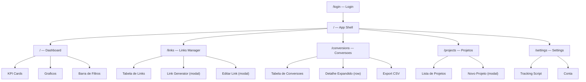
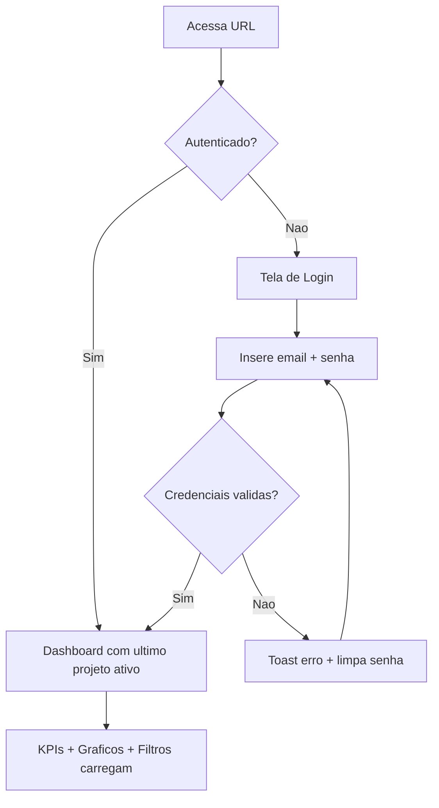
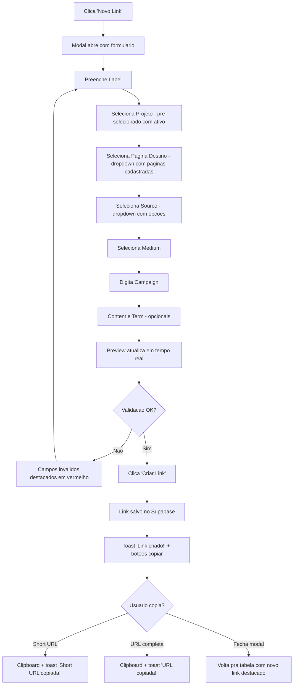
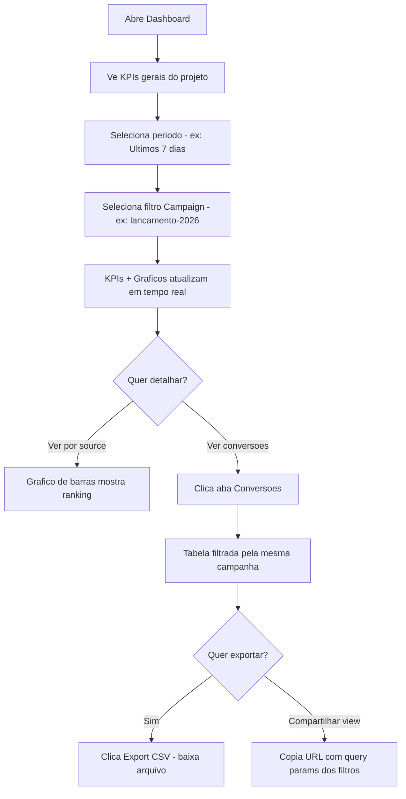
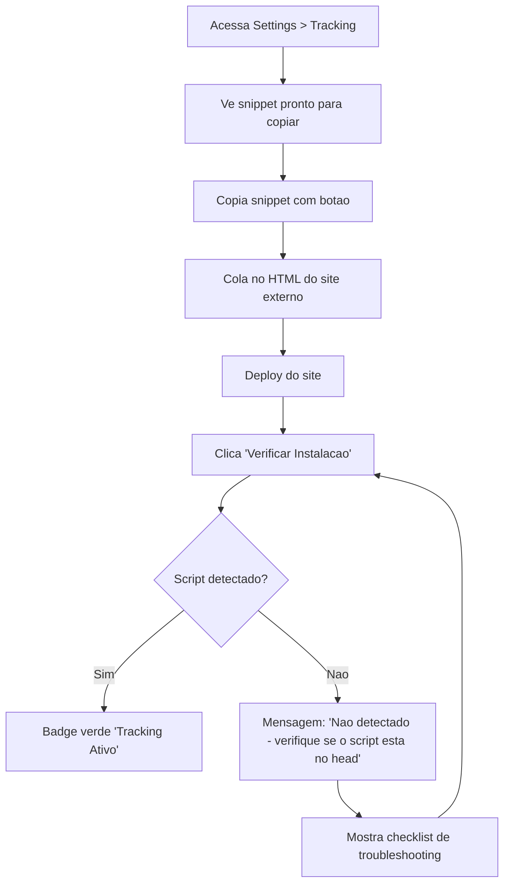

# Potencia Tracking — UI/UX Specification

> Especificacao de interface, design system e experiencia do usuario para o Potencia Tracking.
> Baseado no PRD v0.2 (`docs/prd.md`).

---

## 1. Introduction

This document defines the user experience goals, information architecture, user flows, and visual design specifications for Potencia Tracking's user interface. It serves as the foundation for visual design and frontend development, ensuring a cohesive and user-centered experience.

### 1.1 Target User Personas

- **Gestor de Marketing (primary):** Profissional da equipe HMNews que cria campanhas, distribui links em multiplos canais e precisa ver resultados rapido. Usa o sistema diariamente. Prioriza velocidade de criacao de links e clareza dos dados. Nao e tecnico — precisa de interfaces intuitivas sem jargao.
- **Coordenador de Projeto:** Gerencia multiplos produtos educacionais (cursos, pos-graduacoes, eventos). Precisa alternar entre projetos rapidamente e comparar performance entre canais. Usa semanalmente para relatorios e decisoes de investimento.

**Nota:** Todos os usuarios tem o mesmo nivel de acesso no MVP. Sem roles ou permissoes diferenciados.

### 1.2 Usability Goals

- **Eficiencia:** Criar um link UTM rastreavel em menos de 60 segundos (3 cliques maximo)
- **Clareza imediata:** Abrir o dashboard e entender a performance do projeto em 5 segundos (KPIs visiveis sem scroll)
- **Prevencao de erros:** Auto-sanitize de UTM params, validacao em tempo real, confirmacao para acoes destrutivas
- **Zero onboarding:** Novo membro da equipe deve operar o sistema sem treinamento formal

### 1.3 Design Principles

1. **Dados primeiro, decoracao depois** — Cada pixel serve para informar ou agir. Sem elementos puramente esteticos que competem com dados
2. **Feedback instantaneo** — Toda acao (copiar link, salvar, filtrar) tem resposta visual imediata (<200ms)
3. **Contexto sempre visivel** — Projeto ativo, periodo selecionado e filtros ativos devem estar sempre visiveis sem precisar navegar
4. **Progressive disclosure** — Mostrar o essencial (KPIs, tabela) e revelar detalhes sob demanda (expandir row, abrir modal)
5. **Dark-mode-first, light-mode-ready** — Otimizar contraste e legibilidade para fundo escuro, com toggle acessivel

### 1.4 Change Log

| Date | Version | Description | Author |
|------|---------|-------------|--------|
| 2026-03-10 | 0.1 | Initial frontend spec | Uma (UX) |

---

## 2. Information Architecture (IA)

### 2.1 Site Map / Screen Inventory



### 2.2 Navigation Structure

**Primary Navigation:** Sidebar fixa (desktop) / bottom nav (mobile) com 4 itens:
- Dashboard (icone: BarChart3)
- Links (icone: Link)
- Conversoes (icone: Users)
- Projetos (icone: FolderOpen)

**Secondary Navigation:**
- **Header:** Logo + Project Switcher (dropdown) + Settings (gear icon) + User Menu (avatar + logout)
- **Settings** acessado pelo gear icon no header, nao na sidebar — usado raramente

**Breadcrumb Strategy:** Nao necessario — navegacao flat com apenas 1 nivel de profundidade. O Project Switcher no header funciona como contexto permanente.

---

## 3. User Flows

### 3.1 Flow: Login → Dashboard

**User Goal:** Acessar o sistema e ver performance do projeto ativo

**Entry Points:** URL direta, bookmark

**Success Criteria:** Usuario ve KPIs do projeto em < 3 segundos apos login



**Edge Cases:**
- Sessao expirada durante uso → redirect para /login com toast "Sessao expirada"
- Primeiro login (sem projetos) → Dashboard com empty state + CTA "Criar primeiro projeto"
- Supabase offline → Tela de erro amigavel com botao "Tentar novamente"

### 3.2 Flow: Criar Link UTM

**User Goal:** Gerar um link rastreavel para usar em campanha

**Entry Points:** Botao "Novo Link" na pagina /links, atalho no dashboard

**Success Criteria:** Link criado, copiado para clipboard, pronto para uso



**Edge Cases:**
- Short slug colide (improvavel) → Gera novo automaticamente, transparente ao usuario
- URL base invalida → Validacao inline "URL invalida" antes de permitir submit
- Navegador sem clipboard API → Fallback: seleciona texto + tooltip "Ctrl+C para copiar"
- Perda de conexao ao salvar → Toast erro + mantem formulario preenchido para retry
- Nenhuma pagina cadastrada → Mostra campo URL livre + sugestao "Cadastre paginas no projeto para acesso rapido"

### 3.3 Flow: Analisar Performance de Campanha

**User Goal:** Entender quais canais performam melhor para uma campanha especifica

**Entry Points:** Dashboard (padrao), filtro direto via URL compartilhada

**Success Criteria:** Usuario identifica top source e taxa de conversao da campanha



**Edge Cases:**
- Campanha sem dados → Graficos e tabela com empty state "Nenhum dado para este filtro"
- Filtros compostos retornam 0 resultados → Sugestao "Tente remover o filtro de Medium"
- URL compartilhada com projeto que usuario nao tem acesso → Redirect para projeto padrao com aviso

### 3.4 Flow: Instalar Tracking em um Site

**User Goal:** Ativar tracking em uma landing page/site externo

**Entry Points:** Settings > Tracking, badge "Sem dados" no dashboard

**Success Criteria:** Script instalado, primeiro evento recebido, badge muda para verde



**Edge Cases:**
- Site com CSP restritivo bloqueando script externo → Guia mostra como liberar dominio
- Multiplos projetos no mesmo site → Cada script tag tem `data-project` diferente, coexistem
- Script carrega mas API retorna 429 (rate limit) → Retry silencioso com backoff, sem perder dados

---

## 4. Wireframes & Mockups

**Primary Design Files:** Nenhuma ferramenta externa (Figma/Sketch) no momento — wireframes conceituais abaixo servem como referencia para implementacao com shadcn/ui.

### 4.1 Screen: Login

**Purpose:** Autenticacao da equipe interna

```
┌─────────────────────────────────────────────┐
│                                             │
│                                             │
│           ┌─────────────────┐               │
│           │   ⚡ POTENCIA   │               │
│           │    TRACKING     │               │
│           │                 │               │
│           │ ┌─────────────┐ │               │
│           │ │ Email       │ │               │
│           │ └─────────────┘ │               │
│           │ ┌─────────────┐ │               │
│           │ │ Senha     👁 │ │               │
│           │ └─────────────┘ │               │
│           │                 │               │
│           │ [████ Entrar ████] │             │
│           │                 │               │
│           └─────────────────┘               │
│                                             │
│            Potencia Educacao © 2026         │
└─────────────────────────────────────────────┘
```

**Key Elements:**
- Card centralizado com logo, 2 inputs e botao
- Fundo escuro com card sutilmente elevado (shadow)
- Sem link "esqueci senha" no MVP (reset manual via Supabase)

**Interaction Notes:** Enter submete o form. Loading spinner no botao durante auth. Toast de erro embaixo do card.

### 4.2 Screen: Dashboard

**Purpose:** Overview de performance do projeto ativo com KPIs e graficos

```
┌──────────────────────────────────────────────────────────────────────┐
│ ⚡ Potencia   [▼ Pos-Grad Eletrica]              ⚙  👤 Jonatha ▼  │
├──────┬───────────────────────────────────────────────────────────────┤
│      │ ┌─Filtros──────────────────────────────────────────────────┐ │
│ 📊   │ │ [Ultimos 30d ▼]  [Source ▼]  [Medium ▼]  [Campaign ▼]  │ │
│ Dash │ │                                          [✕ Limpar] (2) │ │
│      │ └─────────────────────────────────────────────────────────┘ │
│ 🔗   │                                                             │
│ Links│ ┌──────────┐ ┌──────────┐ ┌──────────┐ ┌──────────┐       │
│      │ │ Cliques  │ │Conversoes│ │  Taxa    │ │Top Source│       │
│ 👥   │ │  2.847   │ │   341    │ │  11.9%   │ │Instagram │       │
│ Conv │ │ ↑ +23%   │ │ ↑ +8%   │ │ ↓ -2.1%  │ │ 847 hits │       │
│      │ └──────────┘ └──────────┘ └──────────┘ └──────────┘       │
│ 📁   │                                                             │
│ Proj │ ┌──Tendencia──────────────────────────────────────────────┐ │
│      │ │  ▕                    ·  ··                             │ │
│      │ │  ▕               · ·    ·  ·  ·                        │ │
│      │ │  ▕          · ·              ·    ·                    │ │
│      │ │  ▕     · ·                        ·  ·                │ │
│      │ │  ▕──·──────────────────────────────────── cliques     │ │
│      │ │  ▕  -------- conversoes                               │ │
│      │ │  01/03  05/03  10/03  15/03  20/03  25/03  30/03      │ │
│      │ └────────────────────────────────────────────────────────┘ │
│      │                                                             │
│      │ ┌──Top Sources─────────┐  ┌──Atividade Recente───────────┐ │
│      │ │ Instagram ████████ 847│  │ Ana Silva - instagram - 14h │ │
│      │ │ YouTube   █████   523│  │ Pedro M.  - youtube   - 15h │ │
│      │ │ WhatsApp  ████    412│  │ Maria L.  - whatsapp  - 16h │ │
│      │ │ Email     ███     298│  │ João R.   - email     - 17h │ │
│      │ │ Google    ██      189│  │ Carla S.  - google    - 18h │ │
│      │ └───────────────────────┘  └─────────────────────────────┘ │
│      │                                     Atualizado ha 45s 🔄   │
└──────┴───────────────────────────────────────────────────────────────┘
```

**Key Elements:**
- Header: logo, project switcher, settings icon, user menu
- Sidebar: 4 nav items com icones (colapsavel em icon-only)
- Barra de filtros: periodo + 3 dropdowns + badge de filtros ativos + limpar
- 4 KPI cards com valor, variacao % e seta direcional
- Grafico de tendencia (linha) com toggle cliques/conversoes
- Top 5 sources (barras horizontais) + Atividade recente (ultimas 5 conversoes)
- Indicador de ultima atualizacao + botao refresh

### 4.3 Screen: Links Manager

**Purpose:** Tabela com todos os links UTM do projeto, busca e acoes

```
┌──────────────────────────────────────────────────────────────────────┐
│ ⚡ Potencia   [▼ Pos-Grad Eletrica]              ⚙  👤 Jonatha ▼  │
├──────┬───────────────────────────────────────────────────────────────┤
│      │                                                              │
│ 📊   │  🔗 Links                        [+ Novo Link]              │
│      │                                                              │
│ 🔗   │  ┌──🔍 Buscar links...──────────────────────────────────┐   │
│ Links│  └───────────────────────────────────────────────────────┘   │
│  ●   │                                                              │
│ 👥   │  ┌────────────────────────────────────────────────────────┐  │
│      │  │ Label          │Short URL │Source    │Medium │Campaign │⋮│ │
│ 📁   │  ├────────────────┼──────────┼─────────┼───────┼─────────┤  │
│      │  │ Stories Mar     │/r/a3xK9m│instagram│stories│lanc-2026│⋮│ │
│      │  │ Bio Link        │/r/bY2mP4│instagram│bio    │geral    │⋮│ │
│      │  │ Newsletter #12  │/r/cZ8nQ1│email    │news   │nr10     │⋮│ │
│      │  │ Grupo Eletric.  │/r/dW5oR7│whatsapp │grupo  │lanc-2026│⋮│ │
│      │  │ YouTube Desc    │/r/eV3pS6│youtube  │desc   │pos-grad │⋮│ │
│      │  └────────────────────────────────────────────────────────┘  │
│      │                                                              │
│      │  Mostrando 1-5 de 23 links          [← 1  2  3  4  5 →]   │
│      │                                                              │
│      │  ┌─⋮ Menu (ao clicar)─┐                                    │
│      │  │ 📋 Copiar Short URL │                                    │
│      │  │ 🔗 Copiar URL Compl.│                                    │
│      │  │ ✏️  Editar           │                                    │
│      │  │ 📄 Duplicar         │                                    │
│      │  │ 🗑️  Excluir          │                                    │
│      │  └─────────────────────┘                                    │
└──────┴──────────────────────────────────────────────────────────────┘
```

### 4.4 Screen: Link Generator (Modal) — v2

**Purpose:** Formulario assistido para criar link UTM com selecao de projeto e pagina destino

```
┌──────────────────────────────────────────────────┐
│  Novo Link UTM                              ✕    │
├──────────────────────────────────────────────────┤
│                                                  │
│  Projeto                                         │
│  ┌──────────────────────────────────────────┐    │
│  │ ⚡ Pos-Grad Instalacoes Eletricas      ▼ │    │
│  └──────────────────────────────────────────┘    │
│                                                  │
│  Pagina Destino *                                │
│  ┌──────────────────────────────────────────┐    │
│  │ Pagina de Inscricao                    ▼ │    │
│  │ ┌──────────────────────────────────────┐ │    │
│  │ │ ● Pagina Principal                  │ │    │
│  │ │   potenciaeducacao.com.br/pos-grad  │ │    │
│  │ │ ● Pagina de Inscricao              │ │    │
│  │ │   potenciaeducacao.com.br/pos-grad/ │ │    │
│  │ │   inscricao                         │ │    │
│  │ │ ● Webinar Ao Vivo                  │ │    │
│  │ │   potenciaeducacao.com.br/pos-grad/ │ │    │
│  │ │   webinar                           │ │    │
│  │ │ ─────────────────────────────────── │ │    │
│  │ │ + Adicionar nova pagina...          │ │    │
│  │ └──────────────────────────────────────┘ │    │
│  └──────────────────────────────────────────┘    │
│                                                  │
│  Label *                                         │
│  ┌──────────────────────────────────────────┐    │
│  │ Stories Marco - Lancamento               │    │
│  └──────────────────────────────────────────┘    │
│                                                  │
│  ┌──Source *────────┐  ┌──Medium *───────────┐   │
│  │ Instagram      ▼ │  │ Stories           ▼ │   │
│  └──────────────────┘  └────────────────────┘   │
│                                                  │
│  Campaign *                                      │
│  ┌──────────────────────────────────────────┐    │
│  │ lancamento-2026                          │    │
│  └──────────────────────────────────────────┘    │
│                                                  │
│  ┌──Content────────┐  ┌──Term──────────────┐    │
│  │ (opcional)      │  │ (opcional)         │    │
│  └─────────────────┘  └────────────────────┘    │
│                                                  │
│  ┌─Preview─────────────────────────────────────┐ │
│  │ potenciaeducacao.com.br/pos-grad/inscricao  │ │
│  │ ?utm_source=instagram                       │ │
│  │ &utm_medium=stories                         │ │
│  │ &utm_campaign=lancamento-2026               │ │
│  │                                             │ │
│  │ Short: potencia-tracking.vercel.app/r/f4kLm │ │
│  │                                             │ │
│  │ [📋 Copiar URL]  [📋 Copiar Short URL]     │ │
│  └─────────────────────────────────────────────┘ │
│                                                  │
│            [Cancelar]  [████ Criar Link ████]    │
└──────────────────────────────────────────────────┘
```

**Key Changes vs v1:**
- **Projeto** — dropdown no topo, pre-selecionado com projeto ativo mas alteravel
- **Pagina Destino** — combobox com paginas cadastradas do projeto. Mostra nome amigavel + URL. "Adicionar nova pagina..." inline
- **Impacto no schema:** Nova tabela `project_pages` (id, project_id FK, name, url, is_default, created_at)

### 4.5 Screen: Conversoes

**Purpose:** Tabela detalhada de conversoes com busca, filtros e export

```
┌──────────────────────────────────────────────────────────────────────┐
│ ⚡ Potencia   [▼ Pos-Grad Eletrica]              ⚙  👤 Jonatha ▼  │
├──────┬───────────────────────────────────────────────────────────────┤
│      │                                                              │
│ 📊   │  👥 Conversoes (341)                     [📥 Exportar CSV]  │
│      │                                                              │
│ 🔗   │  ┌──🔍 Buscar por nome, email, telefone...──────────────┐   │
│      │  └───────────────────────────────────────────────────────┘   │
│ 👥   │                                                              │
│ Conv │  ┌────────────────────────────────────────────────────────┐  │
│  ●   │  │ Data/Hora▼│ Nome        │ Email           │ Source    │  │
│ 📁   │  ├───────────┼─────────────┼─────────────────┼──────────┤  │
│      │  │ 10/03 14h │ Ana Silva   │ ana@email.com   │instagram │  │
│      │  │ 10/03 11h │ Pedro Moura │ pedro@corp.com  │youtube   │  │
│      │  │ 09/03 22h │ Maria Lima  │ maria@gmail.com │whatsapp  │  │
│      │  │ 09/03 18h │ Joao Reis   │ joao@outlook.com│email     │  │
│      │  └────────────────────────────────────────────────────────┘  │
│      │                                                              │
│      │  ┌─Row Expandida (clique na row)──────────────────────────┐ │
│      │  │ 📋 Ana Silva                                           │ │
│      │  │ Email: ana@email.com  Tel: (11) 98765-4321             │ │
│      │  │ Source: instagram  Medium: stories  Campaign: lanc-2026│ │
│      │  │ Pagina: potenciaeducacao.com.br/pos-grad               │ │
│      │  │ Referrer: instagram.com                                │ │
│      │  │ Tracking ID: 7a3f... Clique original: 10/03 13h42     │ │
│      │  └────────────────────────────────────────────────────────┘ │
│      │                                                              │
│      │  Mostrando 1-25 de 341             [← 1  2 ... 14 →]      │
└──────┴──────────────────────────────────────────────────────────────┘
```

### 4.6 Screen: Projetos

**Purpose:** Lista e CRUD de projetos

```
┌──────────────────────────────────────────────────────────────────────┐
│ ⚡ Potencia   [▼ Todos os Projetos]              ⚙  👤 Jonatha ▼  │
├──────┬───────────────────────────────────────────────────────────────┤
│      │                                                              │
│ 📊   │  📁 Projetos                          [+ Novo Projeto]      │
│      │                                                              │
│ 🔗   │  ┌────────────────────────────────────────────────────────┐  │
│      │  │ ⚡ Pos-Graduacao Instalacoes Eletricas                 │  │
│ 👥   │  │ potenciaeducacao.com.br/pos-grad                      │  │
│      │  │ 23 links · 2.847 cliques · 341 conversoes   [Abrir ▶] │  │
│ 📁   │  ├────────────────────────────────────────────────────────┤  │
│ Proj │  │ 🔌 Curso NR-10 Online                                 │  │
│  ●   │  │ potenciaeducacao.com.br/nr10                          │  │
│      │  │ 8 links · 1.203 cliques · 89 conversoes    [Abrir ▶]  │  │
│      │  ├────────────────────────────────────────────────────────┤  │
│      │  │ 🏭 Expo Eletrica 2026                                 │  │
│      │  │ expoeletrica.com.br                                   │  │
│      │  │ 45 links · 5.621 cliques · 712 conversoes  [Abrir ▶]  │  │
│      │  └────────────────────────────────────────────────────────┘  │
│      │                                                              │
└──────┴──────────────────────────────────────────────────────────────┘
```

### 4.7 Screen: Settings — Tracking

**Purpose:** Snippet de instalacao e status do tracking

```
┌──────────────────────────────────────────────────────────────────────┐
│ ⚡ Potencia   [▼ Pos-Grad Eletrica]              ⚙  👤 Jonatha ▼  │
├──────────────────────────────────────────────────────────────────────┤
│                                                                      │
│  ⚙ Settings > Tracking Script                                      │
│                                                                      │
│  Status: 🟢 Tracking Ativo (ultimo evento: ha 3 min)               │
│                                                                      │
│  ┌─Snippet de Instalacao───────────────────────────────────────────┐ │
│  │ <script async defer                                             │ │
│  │   src="https://potencia-tracking.vercel.app/tracking/           │ │
│  │        pt-tracker.js"                                           │ │
│  │   data-project="pos-grad-eletrica"                              │ │
│  │   data-api="https://potencia-tracking.vercel.app">              │ │
│  │ </script>                                           [📋 Copiar] │ │
│  └─────────────────────────────────────────────────────────────────┘ │
│                                                                      │
│  ┌─Tracking de Conversao (opcional)────────────────────────────────┐ │
│  │ // Chame no submit do formulario:                               │ │
│  │ PotenciaTracker.trackConversion({                               │ │
│  │   email: 'usuario@email.com',                                   │ │
│  │   nome: 'Nome do Usuario',                                     │ │
│  │   telefone: '11999998888'                                       │ │
│  │ });                                              [📋 Copiar]    │ │
│  └─────────────────────────────────────────────────────────────────┘ │
│                                                                      │
│  [🔍 Verificar Instalacao]                                          │
│                                                                      │
│  📖 Guia de Instalacao                                              │
│  ├─ HTML Estatico — Cole antes do </head>                          │
│  ├─ WordPress — Use plugin Insert Headers and Footers              │
│  └─ React/Next.js — Adicione no layout.tsx via next/script         │
│                                                                      │
└──────────────────────────────────────────────────────────────────────┘
```

---

## 5. Component Library / Design System

**Design System Approach:** shadcn/ui como base (copy-paste, nao lib) + design tokens customizados Potencia. Atomic Design: atoms (shadcn primitives) → molecules (composicoes) → organisms (secoes de pagina).

### 5.1 Atoms (shadcn/ui base)

| Component | Variants | States | Usage |
|-----------|----------|--------|-------|
| **Button** | `primary`, `secondary`, `ghost`, `destructive` | default, hover, active, disabled, loading | CTAs, acoes, submit |
| **Input** | `default`, `with-icon`, `with-addon` | default, focus, error, disabled | Formularios, busca |
| **Select / Combobox** | `dropdown`, `searchable` | default, open, selected, disabled | Source, Medium, Campaign, Projeto, Pagina |
| **Badge** | `default`, `success`, `warning`, `destructive`, `outline` | static | Contagem de filtros, status tracking |
| **Card** | `default`, `interactive` | default, hover | KPI cards, project cards |
| **Table** | `default` | loading (skeleton), empty, populated | Links, conversoes |
| **Dialog / Modal** | `default`, `confirm-destructive` | open, closed | Link generator, novo projeto, confirmacao delete |
| **Toast** | `success`, `error`, `info` | enter, visible, exit | Feedback de acoes (copiar, salvar, erro) |
| **Dropdown Menu** | `default` | open, closed | Menu acoes (⋮), user menu |
| **Skeleton** | `line`, `card`, `table-row` | loading | Placeholder durante fetch |
| **Tooltip** | `default` | hover-triggered | Info adicional em icones e valores truncados |

### 5.2 Molecules (composicoes)

| Component | Composicao (atoms) | Purpose |
|-----------|-------------------|---------|
| **KPICard** | Card + texto valor + Badge (variacao %) + icone seta | Exibir metrica com tendencia |
| **SearchBar** | Input (with-icon 🔍) + debounce | Busca em tempo real nas tabelas |
| **FilterDropdown** | Select + Badge (contagem) | Filtro individual (Source, Medium, Campaign) |
| **PeriodSelector** | Select (presets) + DateRangePicker (custom) | Selecao de periodo |
| **ProjectSwitcher** | Combobox + Avatar projeto | Alternar projeto ativo no header |
| **PageSelector** | Combobox + "Adicionar nova" inline | Selecionar pagina destino no link generator |
| **CopyButton** | Button (ghost) + Tooltip + Toast trigger | Copiar URL/short URL para clipboard |
| **ConfirmDialog** | Dialog + texto + Button (destructive) + Button (ghost) | Confirmacao de exclusao |
| **CodeBlock** | Card + pre/code + CopyButton | Snippet de tracking em Settings |
| **EmptyState** | Icone + texto + Button (CTA) | Estado vazio em tabelas e dashboard |

### 5.3 Organisms (secoes de pagina)

| Component | Composicao (molecules) | Page |
|-----------|----------------------|------|
| **AppHeader** | Logo + ProjectSwitcher + Settings icon + UserMenu | Layout global |
| **AppSidebar** | Nav items (icone + label) + collapse toggle | Layout global |
| **FilterBar** | PeriodSelector + 3x FilterDropdown + Badge + "Limpar" | Dashboard |
| **KPIGrid** | 4x KPICard em grid responsivo | Dashboard |
| **TrendChart** | Recharts LineChart + toggle + tooltip | Dashboard |
| **SourceRanking** | Recharts BarChart horizontal + labels | Dashboard |
| **DataTable** | Table + SearchBar + sort headers + paginacao + row expansion | Links, Conversoes |
| **LinkGeneratorForm** | ProjectSwitcher + PageSelector + inputs UTM + preview + CopyButtons | Modal novo link |
| **ProjectCard** | Card + metricas resumidas + botao "Abrir" + menu ⋮ | Projetos |
| **TrackingSetup** | Badge status + CodeBlock (snippet) + CodeBlock (conversao) + "Verificar" | Settings |

---

## 6. Branding & Style Guide

### 6.1 Visual Identity

**Brand Guidelines:** Sem brandbook formal da Potencia Educacao. Identidade derivada dos projetos existentes + posicionamento educacional no setor eletrico.

**Conceito visual:** "Energia controlada" — profissional e confiavel (educacao), com acentos energeticos (eletrica). Dark-mode-first com toques vibrantes nos dados.

### 6.2 Color Palette

#### Dark Mode (Primary)

| Color Type | Name | Hex | Usage |
|-----------|------|-----|-------|
| **Background** | zinc-950 | `#09090b` | App background |
| **Surface** | zinc-900 | `#18181b` | Cards, sidebar, modals |
| **Surface Elevated** | zinc-800 | `#27272a` | Hover states, inputs |
| **Border** | zinc-700 | `#3f3f46` | Dividers, table borders |
| **Text Primary** | zinc-50 | `#fafafa` | Headings, values, labels |
| **Text Secondary** | zinc-400 | `#a1a1aa` | Descriptions, placeholders |
| **Primary** | blue-600 | `#2563eb` | CTAs, primary buttons |
| **Primary Hover** | blue-600 + brightness-110 | — | Hover em primary buttons |
| **Primary Links** | blue-500 | `#3b82f6` | Links, destaques sobre fundo escuro |
| **Accent** | amber-400 | `#fbbf24` | Badges, variacao % positiva |
| **Success** | emerald-500 | `#10b981` | Tracking ativo, conversao, seta up |
| **Warning** | amber-500 | `#f59e0b` | Sem dados recentes, atencao |
| **Error** | red-500 | `#ef4444` | Erro login, seta down, delete |
| **Info** | sky-400 | `#38bdf8` | Toasts informativos, tooltips |

#### Light Mode (Alternate)

| Color Type | Name | Hex | Usage |
|-----------|------|-----|-------|
| **Background** | white | `#ffffff` | App background |
| **Surface** | zinc-50 | `#fafafa` | Cards, sidebar |
| **Border** | zinc-200 | `#e4e4e7` | Dividers |
| **Text Primary** | zinc-900 | `#18181b` | Headings |
| **Text Secondary** | zinc-500 | `#71717a` | Descriptions |
| **Placeholder** | zinc-500 | `#71717a` | Input placeholder (NOT zinc-400) |
| **Primary** | blue-600 | `#2563eb` | CTAs |
| **Primary on Surface** | blue-700 | `#1d4ed8` | Links sobre zinc-50 cards |
| **Warning Text** | amber-700 | `#b45309` | Warning text (NOT amber-600) |

#### Source Colors (dual-mode accessible)

| Source | Dark Mode | Light Mode | Official (ref) |
|--------|----------|-----------|----------------|
| Instagram | `#f43f7a` | `#c2185b` | `#e1306c` |
| YouTube | `#ff4444` | `#d32f2f` | `#ff0000` |
| WhatsApp | `#25d366` | `#0d8a45` | `#25d366` |
| Facebook | `#4a9af5` | `#1565c0` | `#1877f2` |
| LinkedIn | `#3b8de0` | `#0a66c2` | `#0a66c2` |
| Email | `#8494a7` | `#475569` | `#64748b` |
| Google Ads | `#fbbc04` | `#e65100` | `#fbbc04` |
| Bio | `#a78bfa` | `#7c3aed` | `#8b5cf6` |
| Mautic | `#14b8a6` | `#0f766e` | `#14b8a6` |
| Outros | `#a1a1aa` | `#71717a` | `#a1a1aa` |

### 6.3 Typography

**Font Families:**
- **Primary:** Inter — via `next/font/google`
- **Monospace:** JetBrains Mono — para code blocks, URLs

**Type Scale:**

| Element | Size | Weight | Line Height | Usage |
|---------|------|--------|-------------|-------|
| H1 | 30px / 1.875rem | 700 | 1.2 | Titulo da pagina |
| H2 | 24px / 1.5rem | 600 | 1.3 | Titulos de secao |
| H3 | 18px / 1.125rem | 600 | 1.4 | Subtitulos, card headers |
| Body | 14px / 0.875rem | 400 | 1.5 | Texto geral, tabelas |
| Small | 12px / 0.75rem | 400 | 1.5 | Captions, timestamps |
| KPI Value | 32px / 2rem | 700 | 1.1 | Numeros grandes nos KPI cards |
| KPI Delta | 13px / 0.8125rem | 500 | 1.4 | Variacao percentual |
| Code | 13px / 0.8125rem | 400 | 1.6 | Snippets, JetBrains Mono |

### 6.4 Iconography

**Icon Library:** Lucide React — tree-shakeable, 24x24 padrao.

| Context | Lucide Name |
|---------|-------------|
| Dashboard | `BarChart3` |
| Links | `Link` |
| Conversoes | `Users` |
| Projetos | `FolderOpen` |
| Settings | `Settings` |
| Adicionar | `Plus` |
| Copiar | `Copy` |
| Editar | `Pencil` |
| Duplicar | `CopyPlus` |
| Excluir | `Trash2` |
| Buscar | `Search` |
| Filtro | `Filter` |
| Trending Up | `TrendingUp` |
| Trending Down | `TrendingDown` |
| Refresh | `RefreshCw` |
| Logout | `LogOut` |
| Expand | `ChevronDown` |
| External | `ExternalLink` |
| Check | `CheckCircle2` |
| Warning | `AlertTriangle` |

**Usage:** 16px na UI, 20px na sidebar. Stroke 1.5px. Cor herda do parent (currentColor).

### 6.5 Spacing & Layout

**Grid System:** CSS Grid + Flexbox via Tailwind CSS 4.

| Context | Grid |
|---------|------|
| App Layout | sidebar (240px / 64px collapsed) + main (fluid) |
| KPI Cards | 4-col, gap-4. Mobile: 2-col |
| Charts | 2-col (60/40), gap-6. Mobile: 1-col |
| Modals | max-w-lg (32rem) centralizado |

**Spacing Scale:** `space-1` (4px), `space-2` (8px), `space-3` (12px), `space-4` (16px), `space-6` (24px), `space-8` (32px), `space-12` (48px)

**Border Radius:** `rounded-md` (6px) inputs/buttons, `rounded-lg` (8px) cards/modals, `rounded-xl` (12px) KPI cards, `rounded-full` avatars

**Shadows (dark mode):** `shadow-sm` inputs, `shadow-md` cards/dropdowns, `shadow-lg` modals — opacidade aumentada para visibilidade em fundo escuro

### 6.6 WCAG Contrast Validation

All color combinations validated for WCAG AA compliance:

- **Dark mode:** 100% text passes (4.5:1+), focus indicators (3:1+), 6 source colors adjusted lighter
- **Light mode:** 100% text passes, placeholder fixed (zinc-500 not zinc-400), warning fixed (amber-700 not amber-600), 9 source colors adjusted darker
- **Buttons:** Primary uses blue-600 (not blue-500) for 5.2:1 contrast. Destructive hover uses ring indicator instead of lighter bg
- **Disabled states:** Intentionally low contrast (WCAG exempt for disabled elements)

See detailed contrast matrices in the audit appendix.

---

## 7. Accessibility Requirements

### 7.1 Compliance Target

**Standard:** WCAG 2.1 Level AA

### 7.2 Key Requirements

**Visual:**

| Requisito | Spec |
|-----------|------|
| Contraste texto normal | >= 4.5:1 (validated) |
| Contraste texto grande | >= 3:1 |
| Contraste UI components | >= 3:1 |
| Focus indicator | `ring-2` + `ring-offset-2` (buttons), `ring-inset` (lists) |
| Texto redimensionavel | Rem-based scale, funciona ate 200% zoom |
| Sem info apenas por cor | Setas ↑↓ acompanham verde/vermelho nos KPIs |

**Interaction:**

| Requisito | Spec |
|-----------|------|
| Navegacao teclado | Tab order: sidebar → header → conteudo |
| Skip to content | Link visivel no primeiro Tab |
| Focus trap em modais | Escape sempre fecha |
| Touch targets | 44x44px minimo (mobile) |
| Reduced motion | `prefers-reduced-motion` desativa animacoes |

**Content:**

| Requisito | Spec |
|-----------|------|
| Alt text | Logo com alt, icones decorativas `aria-hidden` |
| Heading hierarchy | H1 → H2 → H3, sem pular niveis |
| Form labels | `<label>` associado ou `aria-label` em todo input |
| Error messages | `aria-live="polite"` para erros, `role="alert"` para toasts |
| Tabelas | `<th scope="col">`, `aria-label` na tabela |
| Graficos | `aria-label` descritivo + tabela alternativa |
| Language | `<html lang="pt-BR">` |

### 7.3 ARIA Patterns

| Componente | ARIA Pattern |
|-----------|-------------|
| Sidebar nav | `role="navigation"` + `aria-label` |
| Project Switcher | `role="combobox"` + `aria-expanded` |
| Filter dropdowns | `role="listbox"` + `aria-selected` |
| Modals | `role="dialog"` + `aria-modal` + `aria-labelledby` |
| Toast | `role="status"` + `aria-live="polite"` |
| Confirm dialog | `role="alertdialog"` + `aria-describedby` |
| DataTable sort | `aria-sort` no `<th>` |
| Row expansion | `aria-expanded` + `aria-controls` |
| KPI cards | `role="region"` + `aria-label` |
| Period presets | `role="radiogroup"` + `role="radio"` |

### 7.4 Testing Strategy

| Fase | Ferramenta | Quando |
|------|-----------|--------|
| Automatizado (CI) | `eslint-plugin-jsx-a11y` | Todo commit |
| Automatizado (dev) | `@axe-core/react` overlay | Dev mode |
| Manual (por story) | Keyboard nav + screen reader | Antes de Done |
| Manual (por epic) | Lighthouse >= 90 | Final de epic |
| Visual | Simulador daltonismo (DevTools) | Stories de graficos |

---

## 8. Responsiveness Strategy

### 8.1 Breakpoints

| Breakpoint | Min Width | Max Width | Tailwind |
|-----------|-----------|-----------|----------|
| Mobile | 320px | 639px | default |
| Tablet | 640px | 1023px | `sm:` / `md:` |
| Desktop | 1024px | 1279px | `lg:` |
| Wide | 1280px | — | `xl:` / `2xl:` |

### 8.2 Layout Adaptations

| Componente | Mobile | Tablet | Desktop |
|-----------|--------|--------|---------|
| App Shell | Bottom nav + full width | Sidebar collapsed (64px) | Sidebar expanded (240px) |
| KPI Grid | 2x2 | 4 cols | 4 cols |
| Charts | Stacked vertical | 50/50 side by side | 60/40 side by side |
| Filter Bar | Button → bottom sheet | Inline, wraps | Inline single row |
| DataTable | Cards empilhados | Horizontal scroll | Full table |
| Link Generator | Fullscreen sheet | Modal max-w-lg | Modal max-w-lg |
| Project Cards | 1 col | 2 cols | 3 cols |

### 8.3 Navigation Adaptations

| Componente | Mobile | Tablet | Desktop |
|-----------|--------|--------|---------|
| Primary Nav | Bottom nav (4 icons + labels) | Sidebar collapsed (icons, tooltip) | Sidebar expanded (icons + labels) |
| Project Switcher | Full width dropdown | Header inline | Header inline |
| User Menu | Inside bottom nav | Header avatar | Header avatar + name |
| Filter Bar | Button "Filtros (n)" → bottom sheet | Inline | Inline |

### 8.4 Interaction Adaptations

| Interacao | Desktop | Mobile |
|-----------|---------|--------|
| Copiar link | Hover revela copy | Copy sempre visivel |
| Menu acoes | Dropdown | Bottom sheet (44px touch) |
| Sort tabela | Click header | Botao "Ordenar" |
| Row expansion | Inline expand | Bottom sheet |
| Tooltip | Hover | Long press (300ms) |
| Date picker | Calendar popover | Calendar fullscreen |
| Graficos tooltip | Hover | Tap (persiste) |

### 8.5 Mobile Card Pattern

```
┌─────────────────────────────────┐
│ Stories Marco - Lancamento      │
│ 📱 instagram · stories          │
│ 🏷️ lancamento-2026              │
│ 🔗 /r/a3xK9m                   │
│ [📋 Copiar]  [📋 Short]  [⋮]  │
└─────────────────────────────────┘
```

### 8.6 Bottom Sheet Pattern (mobile)

```
┌─────────────────────────────────┐
│           ── (drag handle)      │
│  Filtros                   ✕    │
│  Periodo                        │
│  [Hoje] [7d] [30d●] [90d] [⚙]│
│  Source    [▼ Todos          ] │
│  Medium   [▼ Todos          ] │
│  Campaign [▼ Todos          ] │
│  [Limpar]    [████ Aplicar ████]│
└─────────────────────────────────┘
```

**Nota:** Filtros no mobile usam "Aplicar" (nao tempo real) para evitar rerenders durante selecao.

---

## 9. Animation & Micro-interactions

### 9.1 Motion Principles

1. **Funcional, nao decorativo** — Toda animacao comunica transicao de estado, feedback ou orientacao
2. **Rapido e sutil** — Duracoes 150-300ms. Usuario nunca espera animacao
3. **Consistente** — Mesmo easing para mesma classe de interacao
4. **Respeitoso** — `prefers-reduced-motion: reduce` desativa tudo

### 9.2 Key Animations

#### Feedback de Acao

| Animation | Trigger | Duration | Easing |
|-----------|---------|----------|--------|
| Toast enter | Acao do usuario | 200ms | ease-out |
| Toast exit | Auto 3s / dismiss | 150ms | ease-in |
| Copy flash | Clique copiar | 150ms | ease-in-out |
| Button press | Click/tap | 100ms | ease-in-out |
| Save highlight | Item criado | 200ms + 2s fade | ease-out |

#### Transicoes de Estado

| Animation | Trigger | Duration | Easing |
|-----------|---------|----------|--------|
| Modal open | Clique acao | 200ms | ease-out |
| Modal close | Escape/cancel | 150ms | ease-in |
| Bottom sheet (mobile) | Tap filtros | 250ms | cubic-bezier(0.32,0.72,0,1) |
| Dropdown open | Clique select | 150ms | ease-out |
| Row expand | Clique row | 200ms | ease-out |
| Row collapse | Clique row | 150ms | ease-in |
| Sidebar collapse | Toggle | 200ms | ease-in-out |

#### Loading & Data

| Animation | Trigger | Duration | Easing |
|-----------|---------|----------|--------|
| Skeleton pulse | Carregando | 1.5s loop | ease-in-out |
| KPI count-up | Dados carregam | 400ms | ease-out |
| Chart draw | Dados carregam | 500ms staggered | ease-out |
| Filter update | Filtro aplicado | 200ms | ease-out |
| Refresh spin | Auto/manual refresh | 600ms | linear |
| Badge pulse | Novo evento | 300ms | ease-out |

#### Navegacao

| Animation | Trigger | Duration | Easing |
|-----------|---------|----------|--------|
| Page transition | Troca de area | 150ms | ease-out |
| Tab indicator | Troca aba | 200ms | ease-in-out |
| Sidebar active | Nova area | instant | — |

### 9.3 Reduced Motion

```css
@media (prefers-reduced-motion: reduce) {
  * {
    animation-duration: 0.01ms !important;
    transition-duration: 0.01ms !important;
  }
}
```

Toasts, modais, KPI count-up: aparecem instantaneamente. Skeleton: cor solida estatica. Unica excecao: refresh spin (feedback critico).

---

## 10. Performance Considerations

### 10.1 Performance Goals

| Metric | Target | Measurement |
|--------|--------|-------------|
| **First Contentful Paint (FCP)** | < 1.2s | Lighthouse |
| **Largest Contentful Paint (LCP)** | < 2.5s | Core Web Vitals |
| **Time to Interactive (TTI)** | < 3.0s | Lighthouse |
| **Cumulative Layout Shift (CLS)** | < 0.1 | Core Web Vitals |
| **Interaction to Next Paint (INP)** | < 200ms | Core Web Vitals |
| **Subsequent navigation** | < 500ms | Client-side |
| **Filter/search response** | < 100ms (perceived) | Client-side |
| **Tracking script load impact** | < 100ms LCP delta | Host page before/after |

### 10.2 Design Strategies

**Rendering:**
- Server Components como padrao — `"use client"` apenas em componentes interativos
- KPIs e tabelas renderizados no servidor para FCP rapido
- Graficos (Recharts) client-only com lazy loading via `next/dynamic`

**Data Fetching:**
- React Query (TanStack Query) para cache, deduplication e background refetch
- `staleTime: 60s` para dados de tracking
- Auto-refresh cada 60s via `refetchInterval`
- Paginacao server-side — nunca carregar 10k+ rows no client

**Assets:**
- Fontes via `next/font` — zero layout shift
- Lucide React tree-shaked — so ~20 icones usados
- Sem imagens pesadas — dashboard data-driven

**Perceived Performance:**
- Skeleton loading em toda transicao de dados
- Optimistic updates em CRUD (link criado aparece antes do server confirmar)
- Prefetch de rotas adjacentes via `<Link prefetch>`

**Bundle:**
- Code splitting por rota (Next.js automatico)
- Recharts importado dinamicamente (ssr: false)
- Supabase client singleton

---

## 11. Next Steps

### 11.1 Immediate Actions

1. Revisar spec com stakeholders — validar telas, cores e fluxos
2. Ativar `@architect` — documento de arquitetura (schema Supabase com `project_pages`, API routes, tracking script, auth middleware)
3. Ativar `@sm` — stories formais a partir dos epics do PRD com decisoes de UI desta spec
4. Setup design tokens — extrair palette, typography e spacing para `tokens.css` com Tailwind CSS 4 `@theme`

### 11.2 Design Handoff Checklist

- [x] All user flows documented (4 flows com edge cases)
- [x] Component inventory complete (11 atoms, 10 molecules, 10 organisms)
- [x] Accessibility requirements defined (WCAG AA, ARIA patterns, testing strategy)
- [x] Responsive strategy clear (4 breakpoints, adaptations)
- [x] Brand guidelines incorporated (dual-mode palette, typography, iconography)
- [x] Performance goals established (Core Web Vitals targets)
- [x] Contrast validated (WCAG AA dark + light mode)
- [x] Animation specs defined (20+ animations with duration/easing)

### 11.3 PRD Updates Required

| Item | Mudanca | Impacto |
|------|---------|---------|
| Nova tabela `project_pages` | Projetos podem ter multiplas paginas destino | Story 1.2, 1.4, 2.1 |
| Link Generator v2 | Selecao de projeto + pagina destino | Story 2.1 ACs |

### 11.4 Agent Prompts

**Architect Prompt:**
> `@architect` — Revise o PRD (`docs/prd.md`) e a frontend spec (`docs/front-end-spec.md`) e crie o documento de arquitetura. Stack: Next.js 16 (App Router), Supabase (PostgreSQL + Auth + RLS), Tailwind CSS 4 + shadcn/ui, Recharts 3, Vercel. Foque em: schema detalhado (incluindo `project_pages`), API routes, tracking script standalone, auth SSR middleware, short links `/r/[slug]`. Incorpore as decisoes de UI da spec (dual-mode colors, component hierarchy, performance strategies).

**SM Prompt:**
> `@sm` — Crie stories formais em `docs/stories/` baseadas nos epics do PRD (`docs/prd.md`). Incorpore as decisoes de UI e componentes da frontend spec (`docs/front-end-spec.md`). Atencao a nova tabela `project_pages` e Link Generator v2.

---

_Potencia Tracking Frontend Spec v0.1 — Uma (UX) — 2026-03-10_
